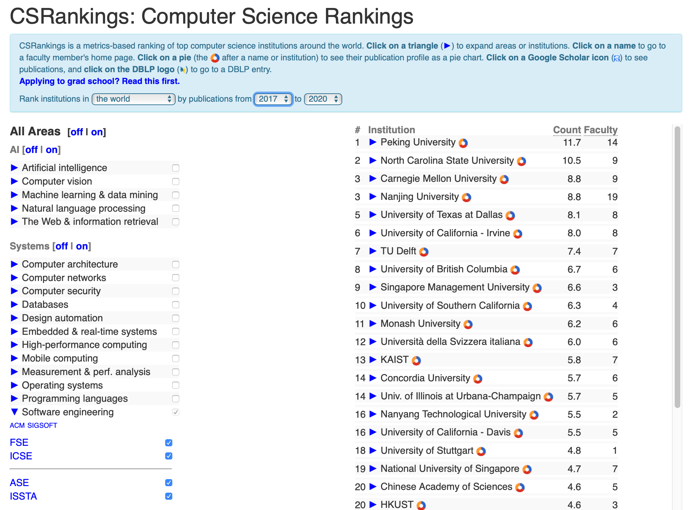

<a name=top>

&nbsp;<a href="https://tiny.cc/seng20">home</a> ::
<a href="https://github.com/txt/se20/blob/master/docs/syllabus.md#top">syllabus</a> ::
<a href="https://github.com/txt/se20/blob/master/docs/syllabus.md#timetable">timetable</a> ::
<a href="https://docs.google.com/spreadsheets/d/1x19m4lmf6eC3pm1l0P-3zHvzySy4ayjUy2AhWp7vrSE/edit#gid=0">groups</a> ::
<a href="https://moodle-courses2021.wolfware.ncsu.edu/course/view.php?id=3873">moodle</a> ::
<a href="http://seng20.slack.com">chat</a>  ::
<a href="https://github.com/txt/se20/blob/master/LICENSE.md#top">&copy; 2020</a>  
 

<table width="100%" border=0 align=center>
<tr>
<td></td>
<td align=center></td>
<td align=center></td>
<td align=center></td>
<td align=center></td>
</tr>
<tr>
<td></td>
<td align=center><b>Lectures</b></td>
<td align=center><b>Project/HW</b>
</td><td align=center><b>Review </td>
<td align=center><b>Events</b> </td>
</tr>
<tr>
<td>

Are you a great software engineer? Can you...

<ul>
<li>
Assess software options; i.e.
<ul>
<li>
   Review  a system; suggest how to build it another, possibly better, way;
  <li> Be able to assess the cost/benefits of those changes.
    <li> including the ethical implications of different designs
</ul>
<li>
 Write "good" software;
  <ul><li> Working in teams, deliver a systems of acceptable quality within eh available resources;  
  <li> That  someone else would want to use;
  <li> That is demonstrable _good_ (compared to something else).
</ul>
</ul>

</td>
<td valign=top  xwidth="100px">

<!-- -------------------------------- -->
<dl>
<dt>
Introduction:
<dd>
<a href="docs/l00hello.md">Hello</a>,  
<a href="docs/syllabus.md">Syllabus</a>

<dt>
Lectures:
<dd>
<a href="http://tiny.cc/seng20aug20">Aug23</a>, 
<a href="http://tiny.cc/seng20aug13">Aug13</a>
</dl>

<!-- -------------------------------- -->

</td><td align=center valign=top xwidth="100px">
<a href="https://docs.google.com/presentation/d/e/2PACX-1vTvSwqxtS70AV3qWWwmuLyZF4eceq7FCkyxsqeqJaZNdw6CPvffCBqsqGM5vH1WL62kJQkN0D4KWyim/pub?start=false&loop=false&delayms=3000&slide=id.g906decb5d4_0_65">Homework3</a>, 
<a href="https://docs.google.com/presentation/d/e/2PACX-1vTvSwqxtS70AV3qWWwmuLyZF4eceq7FCkyxsqeqJaZNdw6CPvffCBqsqGM5vH1WL62kJQkN0D4KWyim/pub?start=false&loop=false&delayms=3000&slide=id.g906decb5d4_0_72">Homework2</a>,  
<a href="docs/h01work.md">Homework1</a>, 
<a href="docs/proj1.md">Project1</a>

</td>
<td align=center   valign=top xwidth="100px">
   
<a href="https://docs.google.com/presentation/d/e/2PACX-1vRNEgXP-wJrm-1OkzJFhSATxcb9updlEZlyKyM5crde3pAg1Xd7uecrKQPRZ4LcmSXfiPpzlW6b7rYw/pub?start=false&loop=false&delayms=3000&slide=id.g90c4847b47_3_2">one</a> 
  
</td>
<td valign=top>
<a href="docs/h01work.md">Hw1</a> due Aug17:2400 
</td>
</tr>

</table>

<h2> gonna b so much FUNNNN !! </h2>

Y'all yearning to be learning? Me too!

Education is the not the filling of a pail, but the lighting of a fire.   
-- W.Yeats

If the world merely lived up to our wildest dreamings, what a dull place it would be. Happily...   
-- Me

Learn why the world wags and what wags it. That is the only thing which the mind
can never exhaust, never alienate, never be tortured by, never fear or distrust,
and never dream of regretting. Learning is the only thing for you. Look what a
lot of things there are to learn.  
-- T.H. White (The Once and Future King)

## Grad subject structure (sample)

## About NC State SE

We're number one! Nearly!

Largest percent female faculty in CS  in the country:

If you want to know our SE work:

 

## About me

http://menzies.us

