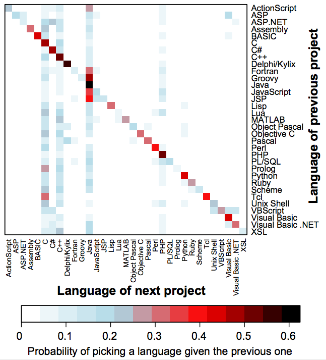

<a name=top>

<a href="https://tiny.cc/seng20">home</a> ::
<a href="https://github.com/txt/se20/blob/master/docs/syllabus.md#top">syllabus</a> ::
<a href="https://moodle-courses2021.wolfware.ncsu.edu/course/view.php?id=3873">moodle</a> ::
<a href="http://seng20.slack.com">chat</a> 
 

 
<a href="https://github.com/txt/se20/blob/master/LICENSE.md#top">&copy; 2020</a> :: 
http://tiny.cc/seng20

# Lecture0: Intro

Y'all yearning to be learning? Me too!

Education is the not the filling of a pail, but the lighting of a fire.   
-- W.Yeats

If the world merely lived up to our wildest dreamings, what a dull place it would be. Happily...   
-- Me

Learn why the world wags and what wags it. That is the only thing which the mind
can never exhaust, never alienate, never be tortured by, never fear or distrust,
and never dream of regretting. Learning is the only thing for you. Look what a
lot of things there are to learn.  
-- T.H. White (The Once and Future King)

## Grad subject structure (sample)

## Q: Which language is best?

A: none of them.

And the language you use next is probably not the one you are using now:

- Empirical Analysis of Programming Language Adoption Leo A. Meyerovich, Ariel Rabkin, OOPSLA ’13.

And even if you are working on some language/tool now, if your work changes, that
could change too

## About NC State SE

We're number one! Nearly!

Largest percent female faculty in CS  in the country:

If you want to know our SE work:

 

## About me

http://menzies.us
