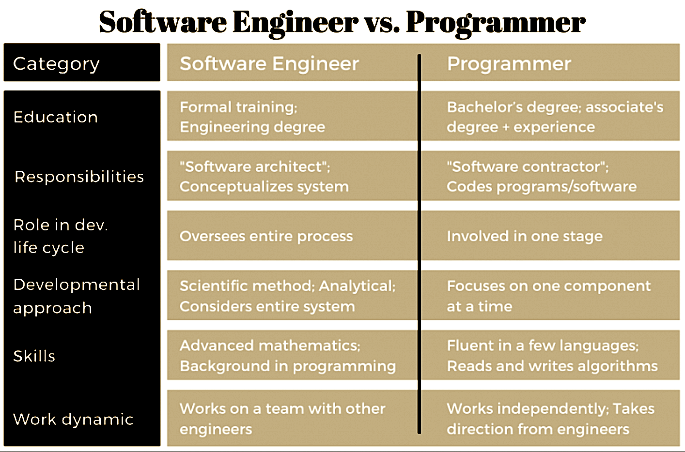

<a name=top>

&nbsp;<a href="https://tiny.cc/seng20">home</a> ::
<a href="https://github.com/txt/se20/blob/master/docs/syllabus.md#top">syllabus</a> ::
<a href="https://moodle-courses2021.wolfware.ncsu.edu/course/view.php?id=3873">moodle</a> ::
<a href="http://seng20.slack.com">chat</a>  ::
<a href="https://github.com/txt/se20/blob/master/LICENSE.md#top">&copy; 2020</a>  
 

# Lecture0: Intro

Y'all yearning to be learning? Me too!

Education is the not the filling of a pail, but the lighting of a fire.   
-- W.Yeats

If the world merely lived up to our wildest dreamings, what a dull place it would be. Happily...   
-- Me

Learn why the world wags and what wags it. That is the only thing which the mind
can never exhaust, never alienate, never be tortured by, never fear or distrust,
and never dream of regretting. Learning is the only thing for you. Look what a
lot of things there are to learn.  
-- T.H. White (The Once and Future King)

## Grad subject structure (sample)

## About NC State SE

We're number one! Nearly!

Largest percent female faculty in CS  in the country:

If you want to know our SE work:

 

## About me

http://menzies.us

## Q: Which language is best?

A: none of them.

And the language you use next is probably not the one you are using now:

- Empirical Analysis of Programming Language Adoption Leo A. Meyerovich, Ariel Rabkin, OOPSLA ’13.

And even if you are working on some language/tool now, if your work changes, that
could change too

Exercise: 7 minutes: the above diagram has clusters at clock positions
1,2,3,4,5,6,7,8,9,10,11,12 and 0 (for the center).
Look up sample tools an report back what kind of software is serviced by
each group.

## Q: So How many languages will you need to know?

Projects are build from  2-5 Programming Languages 

- Mayer, Philip, and Alexander Bauer. "An empirical analysis of the utilization of multiple programming languages in open source projects." 
   Proceedings of the 19th International Conference on Evaluation and Assessment in Software Engineering. 2015.
-  Tomassetti, Federico, and Marco Torchiano. "An empirical assessment of polyglot-ism in github." Proceedings of the 18th International Conference on Evaluation and Assessment in Software Engineering. 2014.

An average engineer routinely uses 7 PLs:

-  Mayer, Philip, Michael Kirsch, and Minh Anh Le. "On multi-language software development, 
   cross-language links and accompanying tools: a survey of professional software developers." Journal of Software Engineering Research and Development 5.1 (2017): 1.

How to learn so many languages:

- Cross-language self-tutoring
- If you can do X in language1, find out how to do X in language2;
- Jean Scholtz and Susan Wiedenbeck. 1990. Learning second and subsequent programming languages: A problem of transfer. International Journal of Human-Computer Interaction 2, 1 (1990), 51–72. 
- N. Shrestha, T. Barik, and C. Parnin. 2018. It’s Like Python But: Towards Supporting Transfer of Programming Language Knowledge. In 2018 IEEE Symposium on Visual Languages and Human-Centric Computing (VL/HCC). 177–185.

## Q: Is programming the same as software engineering?

Exercise: 7 minutes. Discuss:

Here is one person's picture of programmer versus software engineering. Where is it wrong:
- For a large insurance company with 1000s of programmers?
- For some new Silicon Valley start-up with 5 employees?

Human factors:
Convincing you that the system is trustable
Helping you when the systems fails

Current roles of software engineering experts 
when adopting data mining approaches:
Problem definition.
Data collection.
Data “surrogates” (when the joins fail you)
Model building.
Managing organizational impact
- MINKU, L.L.; MENDES, E.; TURHAN, B. . "Data Mining for SE  and Humans in the Loop", Progress in Artificial Intelligence (PRAI), 5(4), 307-314, Nov  2016

Potential roles software engineering experts 
when adopting data mining approaches :
Model building involvement.
Expert domain knowledge.

programmers re the people who know ehn not to program

Ken Thompson, of Unix and C fame, once said "One of my most productive days was throwing away 1000 lines of code."
