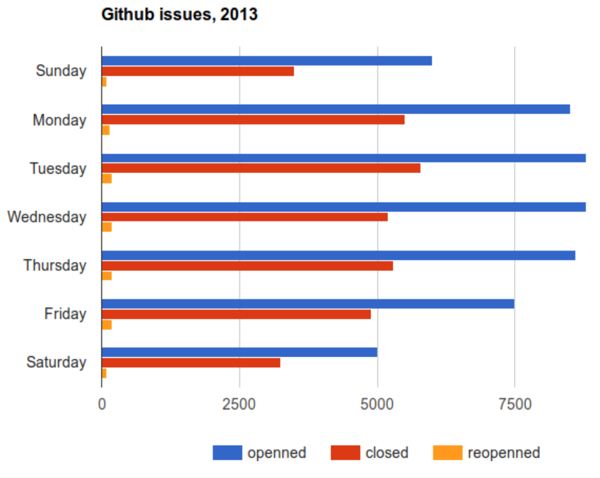

<a name=top>

&nbsp;<a href="https://tiny.cc/seng20">home</a> ::
<a href="https://github.com/txt/se20/blob/master/docs/syllabus.md#top">syllabus</a> ::
<a href="https://github.com/txt/se20/blob/master/docs/syllabus.md#timetable">timetable</a> ::
<a href="https://moodle-courses2021.wolfware.ncsu.edu/course/view.php?id=3873">moodle</a> ::
<a href="http://seng20.slack.com">chat</a>  ::
<a href="https://github.com/txt/se20/blob/master/LICENSE.md#top">&copy; 2020</a>  
 

# Lecture0: Intro

TL;DR: 

- software engineering is not just about programming
- heck, programming is not just about programming
- successful software development needs a range of skills

## Q: Which language is best?

A: none of them.

And the language you use next is probably not the one you are using now:

- Empirical Analysis of Programming Language Adoption Leo A. Meyerovich, Ariel Rabkin, OOPSLA ’13.

And even if you are working on some language/tool now, if your work changes, that
could change too

Exercise: 7 minutes: explore.

- The  above  diagram has clusters at clock positions
1,2,3,4,5,6,7,8,9,10,11,12 and 0 (for the center).
Look up sample tools an report back what kind of software is serviced by
one of those  groups.

 

## Q: So How many languages will you need to know?

Projects are build from  2-5 Programming Languages 

- Mayer, Philip, and Alexander Bauer. "An empirical analysis of the utilization of multiple programming languages in open source projects." 
   Proceedings of the 19th International Conference on Evaluation and Assessment in Software Engineering. 2015.
-  Tomassetti, Federico, and Marco Torchiano. "An empirical assessment of polyglot-ism in github." Proceedings of the 18th International Conference on Evaluation and Assessment in Software Engineering. 2014.

An average engineer routinely uses 7 PLs:

-  Mayer, Philip, Michael Kirsch, and Minh Anh Le. "On multi-language software development, 
   cross-language links and accompanying tools: a survey of professional software developers." Journal of Software Engineering Research and Development 5.1 (2017): 1.

How to learn so many languages:

- Cross-language self-tutoring
- If you can do X in language1, find out how to do X in language2;
- Jean Scholtz and Susan Wiedenbeck. 1990. Learning second and subsequent programming languages: A problem of transfer. International Journal of Human-Computer Interaction 2, 1 (1990), 51–72. 
- N. Shrestha, T. Barik, and C. Parnin. 2018. It’s Like Python But: Towards Supporting Transfer of Programming Language Knowledge. In 2018 IEEE Symposium on Visual Languages and Human-Centric Computing (VL/HCC). 177–185.

## Q: Is programming the same as software engineering?

Programmers don't just program:

- [Tom Zimmermann, Microsoft](https://www.microsoft.com/en-us/research/podcast/the-productive-software-engineer-with-dr-tom-zimmermann/)
-  If you think of a typical software engineer at Microsoft, they spend about half of a day on development related activities, 
     and the other half of the day is spent on other activities like coordinating with other people in meetings, sending emails.... So, 
    there’s actually not that much time that they can spend on writing code, and the time they spend writing code, on a good day, it’s actually 
     only 96 minutes, and on a bad day it’s, on average, 66 minutes. And half an hour writing code actually can make the difference between a bad and a good workday.

What else do "programmers" do:

- Convincing you that the system is trustable
- Helping you when the systems fails

Current roles of software engineering experts 
when adopting data mining approaches:

- Problem definition.
- Data collection.
- Data “surrogates” (when the joins fail you)
- Model building.
- Managing organizational impact
  - MINKU, L.L.; MENDES, E.; TURHAN, B. . "Data Mining for SE  and Humans in the Loop", Progress in Artificial Intelligence (PRAI), 5(4), 307-314, Nov  2016

Programmers are the people who know when not to program:

- Exhibit A: Ken Thompson, of Unix and C fame, once said "One of my most productive days was throwing away 1000 lines of code."
- Exhibit B:

Exercise: 7 minutes. Discuss:
- Here is one person's picture of programmer versus software engineering. Where is it wrong:
  - For a large insurance company with 1000s of programmers?
  - For some new Silicon Valley start-up with 5 employees?
 

