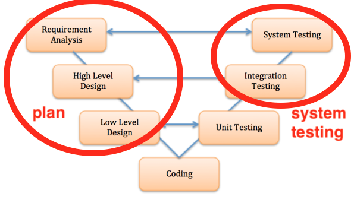
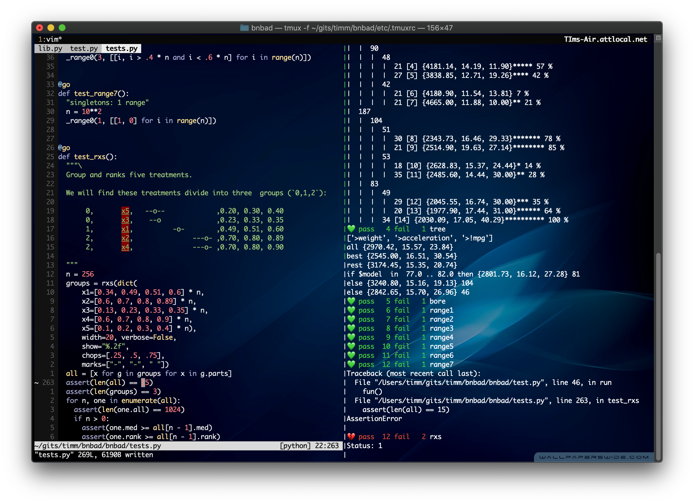
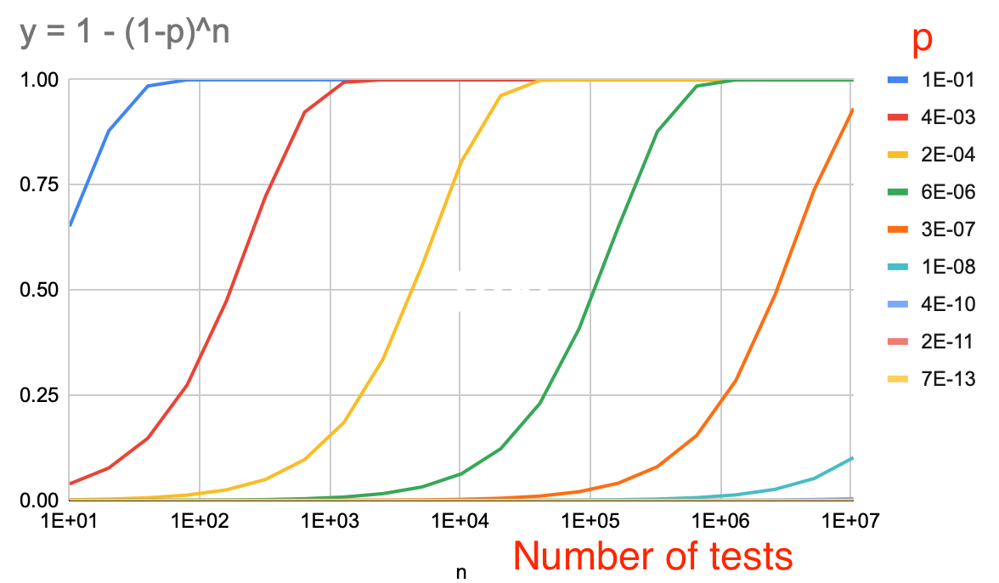
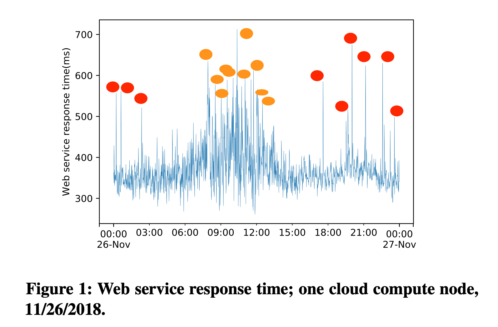
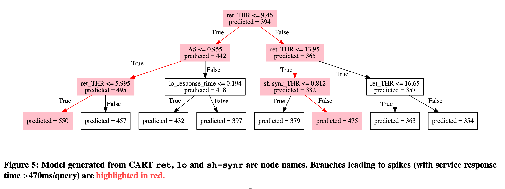

<a name=top>

&nbsp;<a href="https://tiny.cc/seng20">home</a> ::
<a href="https://github.com/txt/se20/blob/master/docs/syllabus.md#top">syllabus</a> ::
<a href="https://github.com/txt/se20/blob/master/docs/syllabus.md#timetable">timetable</a> ::
<a href="https://docs.google.com/spreadsheets/d/1x19m4lmf6eC3pm1l0P-3zHvzySy4ayjUy2AhWp7vrSE/edit#gid=0">groups</a> ::
<a href="https://moodle-courses2021.wolfware.ncsu.edu/course/view.php?id=3873">moodle</a> ::
<a href="http://seng20.slack.com">chat</a>  ::
<a href="https://github.com/txt/se20/blob/master/LICENSE.md#top">&copy; 2020</a>  
 

# Lecture: Testing

Testing bingo: have we covered these terms?

Today:

- Definitions
  - V-diagram, requirements (are a dirty word?), 
  - unit test, systems test, integration test, acceptance test (alpha, beta), 
    contractual and regulatory
  - state space
  - Goals: functional (e.g. Performance), non-functional (e.g. the "ilities")
- Testing is East: Test-driven development
  - is a useful process (for small teams)
  - gets very complex for large teams
  - is not a quality assurance activity
  - red, green, refactor
- Testing is hard
  - Infinitely good tests are infinitely expensive

Later: 

- Types of testing
  - black box (aka functional), all-pairs, metamorphic testing, fuzzing (dumb, generational, 
    mutation, coverage)
  - white box, formal testing
  - Coverage criteria: path, state, transition, function, statement, du, branch
- Test case prioritization 
  - O'nite regression tests
    - Triage
- Software works (usually). Why? How can we exploit that?

## Quotes

- f u cn rd ths, u cn gt a gd jb n sftwr tstng. 
  - Anonymous
- "Program testing can be a very effective way to show the presence of bugs, but is hopelessly inadequate for showing their absence." 
  -  Edsger Dijkstra
- If debugging is the process of removing bugs, then programming must be the process of putting them in. 
  - Edsger Dijkstra
- Beware of bugs in the above code; I have only proved it correct, not tried it. 
  - Donald Knuth
- ... it is a fundamental principle of testing that you must know in advance the answer 
   each test case is supposed to produce. If you don't, you are not testing; you are experimenting." 
  - Kernighan and Plauger
- Debugging is like a mystery novel where you are both the
  detective and the murderer.   
  - Anon

## History

Testing had to be discovered:
- It was on one of my journeys between the EDSAC room and the 
  punching equipment that ‘hesitating at the angles of stairs the 
  realization came over me with full force that a good part of the 
  remainder of my life was going to be spent in finding errors in 
  my own programs.
  - Maurice Wilkes 1951

First bug

Testing is most of our effort:

- V-diagram
  - "Without requirements or design, programming is the art of adding bugs to an empty text file."    
    -- Louis Srygley
  - Brooks, [Mythical Man Month](https://web.eecs.umich.edu/~weimerw/2018-481/readings/mythical-man-month.pdf).
    Effort is
    - 1/3 th planning
    - 1/6 th coding
    - 1/4 th unit testing
    - 1/4 th systems testing

-----

Q: Does testing need requirements?
The V-diagram says we must do requirements engineering to uncover the test cases needed
for later life cycle

3. If no requirements, what sort of things can you test?
1.  Can requirements be kept up to date 
  for  large Silicon Valley companies e.g. Facebook (where tens of thousands of programmers
  update millions of lines per day)?
2. Is an up-to-date requirements documentation avoidable  for safety critical community (who have to do
  regulatory tests to certify that, say, planes
  are safe to fly)?

 

-----

## Some Introductory Terms

- Unit tests: testing your code
- Systems test: testing how your code works with everyone else's (harder)
- Integration testing: verify the interfaces between components against a software design.
- Acceptance testing: 
  - User acceptance testing
  - Contractual and regulatory acceptance testing
  - Alpha and beta testing
    - Alpha testing is simulated or actual operational testing by potential users/customer
    - Follows alpha testing: external testing with a larger audience
      - Released to a limited audience outside of the programming team
- State space: options inside a project
  - 300 boolean options = 2300 states
    - Given numeric models, search space is infinite
  - Inside our software is more states than stars in the sky (1021)

## Testing is Easy (not): Test-driven-Development

Have lots of unit tests!  
Run them, a lot!   
Get them all passing before checking back to main!   
Do not make them into a  religion!   

Tests suites that run every time you save code

-  Build tests first
- Repeat:
  - Red = fund a broken test
  - Green= fix the test
  - Refactor= sometimes, clean things up
    - Refactoring means functionality _stays the same_ but the resulting _code is simpler_.
  
- Tips:
  - rerun "python3 mycode.py" or some pytest equalizing
  - keep the tests short (or else)
  
Test suites that you commit code. 
  - `.travis.yml`
  - keep the tests short (perhaps, not so short)

Kent Beck, 2003:
- No studies have categorically demonstrated the difference be- tween TDD and any of the many
  alternatives in quality, productivity, or fun. 
  However, the anecdotal evidence is overwhelming, and the secondary effects are unmistakable

[David Hansson](https://www.youtube.com/watch?v=9LfmrkyP81M),  2013:
- Lots of developers that push TDD make you feel like your code is dirty if you are not using TDD.
- Driving your design from unit tests is not a good idea.
- The TDD notion of “tests must be fast” is shortsighted.
- The faith in TDD can lead to completely forgetting about system testing.
- The focus on the unit and the unit only does not help with producing a great system.
- 100% coverage is silly

Karac + Turhan (2018): TDD can't really be  defined or shown to be effective
- [What Do We (Really) Know about Test-Driven Development? ](https://www.researchgate.net/profile/Itir_Karac/publication/326239274_What_Do_We_Really_Know_about_Test-Driven_Development/links/5cee7550299bf1f881494cf6/What-Do-We-Really-Know-about-Test-Driven-Development.pdf)   
   -- Itir Karac and Burak Turhan

- TDD has too many cogs,
- Its effectiveness is highly influenced by the context (for example, the tasks at hand or skills of individuals),
- The cogs highly interact with each other
  - e.g. Insufficient TDD experience of knowledge
  - e.g.   Insufficient design
  - e.g. Insufficient developer testing kills,
  - e.g. Domain and tool specific limitations
  - e.g. Precedence of legacy code
  - e.g.  Insufficient adherence to TDD testing protocol,
    -  TDD isn’t a dichotomy in which you either religiously
        - write tests first every time
        - or always test after the fact. 
        - TDD is a continuous spectrum between these extremes, 
           - Developers tend to dynamically span this spectrum, adjusting the TDD process as needed
           -  Studies of 416 developers over more than 24,000 hours
               -  only 12 percent of the projects that claimed to use it, actually did 
                  "write test first"
           - Studies of all Java projects in Github
             - applied heuristics for identifying TDD-like repositories
             - Only 0.8 % were TDD. And in that set, no evidence for
               - no evidence for higher commit velocity
               - no evidence for more issues reported or retired
  - Does TDD only perform better when compared to a coarse-grained
    rigid old-fashioned development waterfall process?
    - TDD’s superiority over a test-last approach were due to the fact that most of the 
  experiments employed a coarse-grained test-last process closer to the waterfall
  approach as a control group

<!-- img src="../etc/img/tddreview.png" -->

-----

Q: How many/what kind of tests are you looking for in Project1 software?

1. What are your "bad smells" for looking at a project and saying "...nah, not enough tests?"
2. What guidelines should we offer people during Project1?

 

-----

## Test is Hard

### What are you testing for?

- Testing to check that the promised behavior actually works?
  - But the documentation is incomplete, always
  - Even if we try to make it complete, complete for  who?
    - e.g. Stakeholders, competing goals
    - Toronto CS department. Information stem
      - "good" if parents can track their children
      - "good" if students  can maintain their privacy
    - How to write tests?
- Are any of the following mutually exclusive?
  - For "maintainability?" 
    - how to test that, except to watch the code for years to come?
    - Research task: can we learn from prior maintainability?
  - Performance:
    - Energy usage
    - Network request response time?
    - Minimize variance in query   times
    - etc etc 
  - For "usability"? Did you do that in HW3? 
    - For other "ilities" (maintainability, customizability, 
      scalability,
      capacity, availability, reliability, recoverability, maintainability,
      serviceability, security, regulatory, manageability, environmental,
      data integrity, interoperability fairness  
  
### Testing is Hard: a little Maths

Consider test some web-based app
- Everything that happens to it depends on events, elsewhere on the web
- Those events happen at probability _p_
- So they don't happen at probability _(1-p)_
- So they don't happen after _n_ tests at probability _(1-p)n_
- So they do  happen after _n_ tests at probability 
  _C(p,n) = 1- (1-p)n_
- That's a lot of tests

Problems:
- Infinite testing is infinitely expensive
  - rearranging 
    _C(p,n) = 1- (1-p)n_
    we get  
    _n = log(1-C) / log(1-p)_  
  - For certainty (_C=1_) for low probability events (small _p=0_)  then _n_ explodes.
- Real world events hard to model with certainty
  - Events happen at probability _p_? 
  - What _p_?

Also, what about rare events?

Can apply some non-simple stats to model arbitrary distributions as combinations of 
(e.g.) Gaussian kernels (think wavlets or Fourier series, if you
know that stuff).

Or, for really weird functions, use non-parametric methods that divide the data into
chunks, then reasons separately about each chunk:

----- 

Q: How does testing work?

- It should be impossible to test anything. So why does software work... at all? Ever?

 

-----

