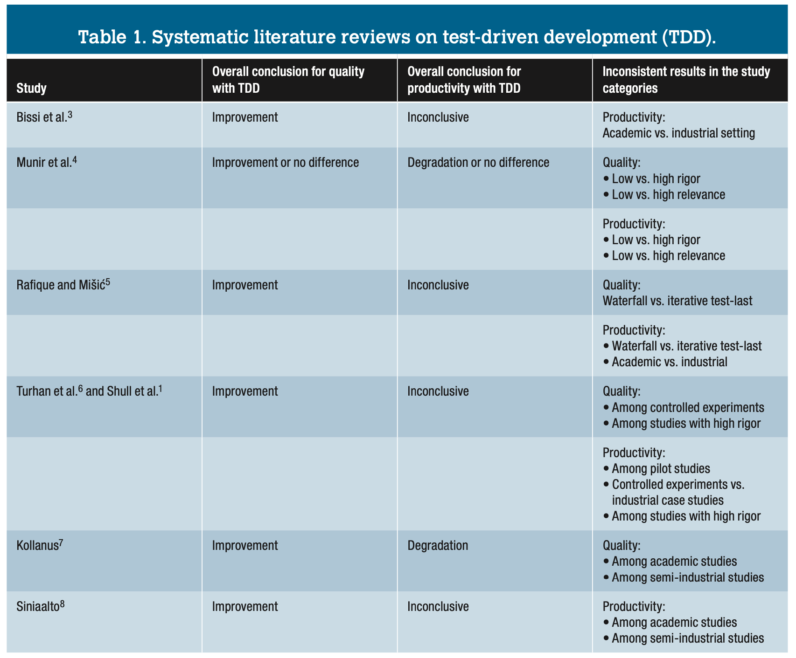
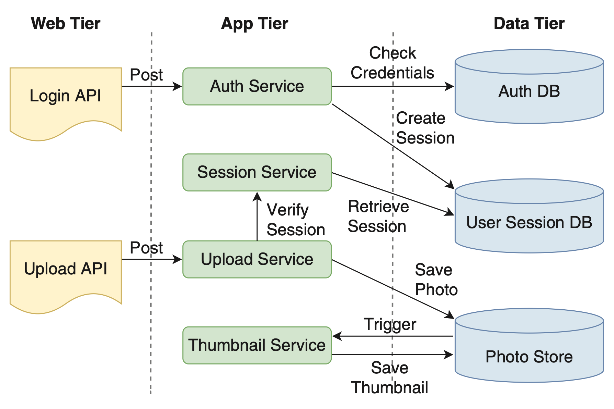

<a name=top>
<a href="http://tiny.cc/seng20"></a>
<hr>
<p>
&nbsp;<a href="https://tiny.cc/seng20">home</a> ::
<a href="https://github.com/txt/se20/blob/master/docs/syllabus.md#top">syllabus</a> ::
<a href="https://github.com/txt/se20/blob/master/docs/syllabus.md#timetable">timetable</a> ::
<a href="https://docs.google.com/spreadsheets/d/1x19m4lmf6eC3pm1l0P-3zHvzySy4ayjUy2AhWp7vrSE/edit#gid=0">groups</a> ::
<a href="https://moodle-courses2021.wolfware.ncsu.edu/course/view.php?id=3873">moodle</a> ::
<a href="http://seng20.slack.com">chat</a>  ::
<a href="https://github.com/txt/se20/blob/master/LICENSE.md#top">&copy; 2020</a>  
<br>
<hr>

XXX to do
- fuzzing
- metamorphic testing

# Lecture: Testing
High points:

- Definitions
  
  - V-diagram, requirements (are a dirty word?), unit test, systems test
  - state space
  - black box, white box, formal testing
  - test driven development (red, green, refactor)
  - test case prioritization 
  - O'nite regression tests
    - Triage
- Test-driven development
  - is a useful process (for small teams)
  - gets very complex for large teams
  - is not a quality assurance activity
- Increasing vision is increasing expensive
  - Infinitely good tests are infinitely expensive
- Software works (usually). Why? How can we exploit that?

## Quotes


- f u cn rd ths, u cn gt a gd jb n sftwr tstng.<br>
  - Anonymous
- "Program testing can be a very effective way to show the presence of bugs, but is hopelessly inadequate for showing their absence."<br>
  -  Edsger Dijkstra
- If debugging is the process of removing bugs, then programming must be the process of putting them in.<br>
  - Edsger Dijkstra
- Beware of bugs in the above code; I have only proved it correct, not tried it.<br>
  - Donald Knuth
- ... it is a fundamental principle of testing that you must know in advance the answer 
   each test case is supposed to produce. If you don't, you are not testing; you are experimenting."<br>
  - Kernighan and Plauger
- Debugging is like a mystery novel where you are both the
  detective and the murderer.   
  - Anon

## History

Testing had to be discovered:
- It was on one of my journeys between the EDSAC room and the 
  punching equipment that ‘hesitating at the angles of stairs the 
  realization came over me with full force that a good part of the 
  remainder of my life was going to be spent in find- ing errors in 
  my own programs.
  - Maurice Wilkes


First bug


Testing is most of our effort:


- V-diagram
  - "Without requirements or design, programming is the art of adding bugs to an empty text file."    
    -- Louis Srygley
  - Brooks, [Mythical Man Month](https://web.eecs.umich.edu/~weimerw/2018-481/readings/mythical-man-month.pdf).
    Effort is
    - 1/3 th planning
    - 1/6 th coding
    - 1/4 th unit testing
    - 1/4 th systems testing


## Definitions

- Unit tests: testing your code
- Systems test: testing how your code works with everyone else's (harder)
- Integration testing: verify the interfaces between components against a software design.
- Acceptance testing: 
  - User acceptance testing
  - Operational acceptance testing
  - Contractual and regulatory acceptance testing
  - Alpha and beta testing
    - Alpha testing is simulated or actual operational testing by potential users/customer
    - Follows alpha testing: external testing with a larger audience
      - Released to a limited audience outside of the programming team
- State space: options inside a project
  - 300 boolean options = 2<sup>300</sup> states
    - Given numeric models, search space is infinite
  - Inside our software is more states than stars in the sky (10<sup>21</sup>)
- Blackbox:
  - Can't look inside the code
  - Look for clusters in the inout or output sace
    - e..g if age runs 0...120
      - try -1 60 150  
    - e.g. all pairs testing
      - Let the inputs be a vector showing choices per input
        - Find inouts that never use the same pair of values, twice.
      - e.g. three binary inputs, one "days of week"
        and something with a range of 10 inputs
        - e.g. (2 2 2 7 10) 
      - when processed by an
        [_all-pairs_](https://gist.github.com/timm/1c270e6d40715f4f9cfce123eea3badf/archive/a9102cd968e39b89824e669c8caa2f1f2b9f13ba.zip)
         generator   
        `(ipo '(2 2 2 7 10))`  (see below)
      - BTW, all pairs is an amazing heuristic for exploring a large
        space
```lisp
((2 2 1 1 1) ; e.g. (true true true and first value of rest)
 (2 1 2 2 2) (1 2 2 3 3) (1 1 1 4 4) 
 (2 2 2 7 5) (2 2 2 6 6) (2 2 2 5 7) 
 (2 2 2 4 8) (1 1 2 1 9) (1 1 1 7 10)
 (1 1 1 6 5) (1 1 1 5 6) (2 1 1 3 3) 
 (1 2 1 2 2) (2 2 1 7 9) (1 1 1 7 8) 
 (1 1 1 7 7) (0 0 0 7 6)  ; note "0" means "don't care"
 (2 2 2 7 4) (0 0 0 7 3) (0 0 0 7 2) 
 (1 1 2 7 1) (2 2 2 6 10) (0 0 0 6 9) 
 (0 0 0 6 8) (0 0 0 6 7) (0 0 0 6 4) 
 (0 0 0 6 3) (0 0 0 6 2) (0 0 0 6 1)
 (0 0 0 5 10) (0 0 0 5 9) (0 0 0 5 8) 
 (0 0 0 5 5) (0 0 0 5 4) (0 0 0 5 3) 
 (0 0 0 5 2) (0 0 0 5 1) (0 0 0 4 10) 
 (0 0 0 4 9) (0 0 0 4 7) (0 0 0 4 6) 
 (0 0 0 4 5) (0 0 0 4 3) (0 0 0 4 2)
 (0 0 0 4 1) (0 0 0 3 10) (0 0 0 3 9) 
 (0 0 0 3 8) (0 0 0 3 7) (0 0 0 3 6) 
 (0 0 0 3 5) (0 0 0 3 4) (0 0 0 3 2) 
 (0 0 0 3 1) (0 0 0 2 10) (0 0 0 2 9) 
 (0 0 0 2 8) (0 0 0 2 7) (0 0 0 2 6)
 (0 0 0 2 5) (0 0 0 2 4) (0 0 0 2 3) 
 (0 0 0 2 1) (0 0 0 1 10) (0 0 0 1 8) 
 (0 0 0 1 7) (0 0 0 1 6) (0 0 0 1 5) 
 (0 0 0 1 4) (0 0 0 1 3) (0 0 0 1 2))
```
      - BTW, all pairs is an interesting way to explore large spaces


## TEsting for what?

- Documentation : 
  - Incomplete, always
  - Even if we try to make it complete, compelte for who
    - Stakeholders, competing goals
    - Toronto CS department. Inforamtions sytem
      - "good" if parents can track their children
      - "good" if students  can maintain their privacy
- For "maintainaility?" 
  - how to test that, except to watch the code for eyars to comde?
  - Research task: can we learn from prior :amtainitanibility_?
- Perfroamce:
  - Energy usage
  - Network request repsonse time?
  - Minimize variance in qery spres time 

- For "usabulity"? 
  - For other "ilities" (maintainabiity, customizbiity
    Scalability
Capacity
Availability
Reliability
Recoverability
Maintainability
Serviceability
Security
Regulatory
Manageability
Environmental
Data Integrity
Usability
Interoperability
- 
## Increasing vision is increasing expensive

Consider test some web-based app
- Everything that happens to it depends on events, elsewhere on the web
- Those events happen at probability _p_
- So they don't happen at probability _(1-p)_
- So they don't happen after _n_ tests at probability _(1-p)<sup>n</sup>_
- So they do  happen after _n_ tests at probability 
  _C(p,n) = 1- (1-p)<sup>n</sup>_
- That's a lot of tests


Problems:
- Infinite testing is infinitely expensive
  - rearranging 
    _C(p,n) = 1- (1-p)<sup>n</sup>_
    we get  
    _n = log(1-C) / log(1-p)_  
  - For certainty (_C=1_) for low probability events (small _p=0_)  then _n_ explodes.
- Real world events hard to model with certainty
  - Events happen at probability _p_? 
  - What _p_?


Also, what about rare events?


Can apply some non-simple stats to model arbitrary distributions as combinations of 
(e.g.) Gaussian kernels (think wavlets or Fourier series, if you
know that stuff).


Or, for really weird functions, use non-parametric methods that divide the data into
chunks, then reasons separately about each chunk:


**QUESTION** <em>Is this testing? Is it monitoring? Is learning and automatically re-learning
this tree a better way to do "testing"?</em>
 

## Test-driven-Development


Tests suites that run every time you save code

-  Build tests first
- Repeat:
  - Red = fund a broken test
  - Green= fix the test
  - Refactor= sometimes, clean things up
    - Refactoring means functionality _stays the same_ but the resulting _code is simpler_.
  
- Tips:
  - rerun "python3 mycode.py" or some pytest equalizing
  - keep the tests short (or else)
  
Test suites that you commit code. 
  - `.travis.yml`
  - keep the tests short (perhaps, not so short)

Kent Beck, 2003:
- No studies have categorically demonstrated the difference be- tween TDD and any of the many
  alternatives in quality, productivity, or fun. 
  However, the anecdotal evidence is overwhelming, and the secondary effects are unmistakable

[David Hansson](https://www.youtube.com/watch?v=9LfmrkyP81M),  2013:
- Lots of developers that push TDD make you feel like your code is dirty if you are not using TDD.
- Driving your design from unit tests is not a good idea.
- The TDD notion of “tests must be fast” is shortsighted.
- The faith in TDD can lead to completely forgetting about system testing.
- The focus on the unit and the unit only doesn’t help with producing a great system.
- 100% coverage is silly

TDD can't be defined or shown to be effective

XXX burak [What Do We (Really) Know about Test-Driven Development? ](https://www.researchgate.net/profile/Itir_Karac/publication/326239274_What_Do_We_Really_Know_about_Test-Driven_Development/links/5cee7550299bf1f881494cf6/What-Do-We-Really-Know-about-Test-Driven-Development.pdf)   
-- Itir Karac and Burak Turhan

- TDD has too many cogs,
- Its effectiveness is highly influ enced by the context (for example, the tasks at hand or skills of individuals),
- The cogs highly interact with each other
  - e.g. insufficient TDDB expereince of knowledge
  - e.g.   insufficient design
  - e.g. insufficient developer testing kills,
  - e.g. domain and tool specific limitations
  - e.g. Precedence of legacy code
  - e.g.  insufficient adberence to TDD testing protocol,
    -  TDD isn’t a dichotomy in which you either religiously
        - write tests first every time
        - or always test after the fact. 
        - TDD is a continuous spectrum between these extremes, 
          - Developers tend to dynamically span this spectrum, adjusting the TDD process as needed
- DD’s superiority over a test-last approach were due to the fact that most of the 
  experiments employed a coarse-grained test-last process closer to the waterfall
  approach as a control group
- Does TDD only perform better when compared to a coarse-grained development waterfall process?



For example, after monitoring the development activity of 416 de- velopers over more than 24,000 hours, researchers reported that the developers followed TDD in only 12 percent of the projects that claimed to use it.10 We’ve observed similar patterns in our work with professional developers. Indeed, if it were possible to reanalyze all exist- ing evidence considering this facet only, the shape of things might change significantly (for better or worse). We’ll be the devil’s advocate and ask, what if the anecdotal evi- dence from TDD enthusiasts is based on misconceived personal experience from non-TDD activities?
Similarly, a recent study analyzed a September 2015 snapshot of all the (Java) projects in GitHub.11 Using heuristics for identifying TDD-like repositories, the researchers found that only 0.8 percent of the projects adhered to TDD protocol. Further- more, comparing those projects to a control set, the study reported no difference between the two groups in terms of
• the commit velocity as a measure of productivity,
the number of bug-fixing com- mits as an indicator of the num- ber of defects, and
• the number of issues reported for the project as a predictor of quality.
Additionally, a comparison of the number of pull requests and the dis- tribution of commits per author didn’t indicate any effect on devel- oper collaboration.

Excessive test:
- Google overdose three bullion
- LN cant ick where tests codm from 

## Wy Does testing work

- Most software spent  most of its time within a small number of states
- Druzdel

XXXX

- Bugs are lazy. Clump together. Best predictor of next bug is the last bug.
  GCC clum

It took several decades to find the experience required to build a size/defect relation- ship. In 1971, Fumio Akiyama described the first known “size” law, saying the number of defects D was a function of the number of lines of code; specifically
D = 4.86+0.018⇤loc
Alas, nothing is as simple as that. Lessons come from experience and, as our experience grows, those lessons get refined/replaced. In 1976, Thomas McCabe [290] argued that the number of lines of code was less important than the complexity of that code. He proposed “cyclomatic complexity”, or v(g), as a measure of that complexity and offered the now (in)famous rule that a program is more likely to be defective if:
v(g) > 10
At around the same time, other researchers were arguing that not only is programming an inherently buggy process, its also inherently time-consuming. Based on data from 63 projects, Barry Boehm [37] proposed in 1981 that linear increases in code size leads to exponential increases in development effort:
effort=a⇥KLOCb ⇥Y(Emi ⇥Fi) (1.1) i
Here, a, b are parameters that need tuning for particular projects and Emi are “effort multiplier” that control the impact of some project factor Fi on the effort. For example, if Fi is“analysts capbaility” and it moves from “very low” to “very high”, then accord- ing to Boehm’s 1981 model, Emi moves from 1.46 to 0.71 (i.e. better analysts let you deliver more systems, sooner).

## Testing for Safety crite systems

testing for safety cirtical systems is a different animal. demand u mining isystem. eg. rules for safety critical. small size. on one main loop. if you can find it n 15 seconds go look got it sit safe way

## Formal methods at amaozon

(From [One-Click Formal Methods](http://www0.cs.ucl.ac.uk/staff/b.cook/oneclick.pdf):

- FORMAL METHODS: mathematically based approaches for specifying, building, 
  and reasoning about software. 
- Despite 50 years of research and development, formal methods have had 
  only limited impact in industry. 
- Some in such domains as microprocessor design and aerospace.

Why not widely used?

- _The modeling cost_: 
  Analysts must create a systems model (what is the system)
  and a properties model (what is meant to do). Properties model
  usually much smaller than systems model.
- _The execution cost_: Rigorous analysis of formal properties needs a  full search of  systems model. 
- _The personnel cost:_ Analysts skilled in formal methods must be recruited or trained. 
  Such analysts are generally hard to find and retain.
- _The development brake:_ The above costs can be so high that the requirements must be 
   frozen for some time while we perform the formal analysis. 
   Hence, one of the costs of formal analysis is that it can slow the process of requirements evolution. 

Recent experience at Amazon:

- More and more, web-based systems are configured in sufficient detail 
  - Such that processes can be bounced around from node to node on the cloud (to make best use of spare resources)
  - Application program interfaces (APIs) of cloud services are computer-readable contracts that establish and govern how the system behaves.
    - Most importantly, since those models are utilized by a large user community, 
      - now economically feasible to build the tools needed to verify them
  - Which means that we have enough information to auto-configure our formal methods 
    - and the size of the potential user community and the business value now justifies the cost of formal methods.



## The Truth About Testing

- "Don’t worry if it doesn’t work right.  If everything did, you’d be out of a job."    
  -  Mosher’s Law of Software Engineering
- "One (person)’s crappy software is another man’s full time job."     
  -  Jessica Gaston
