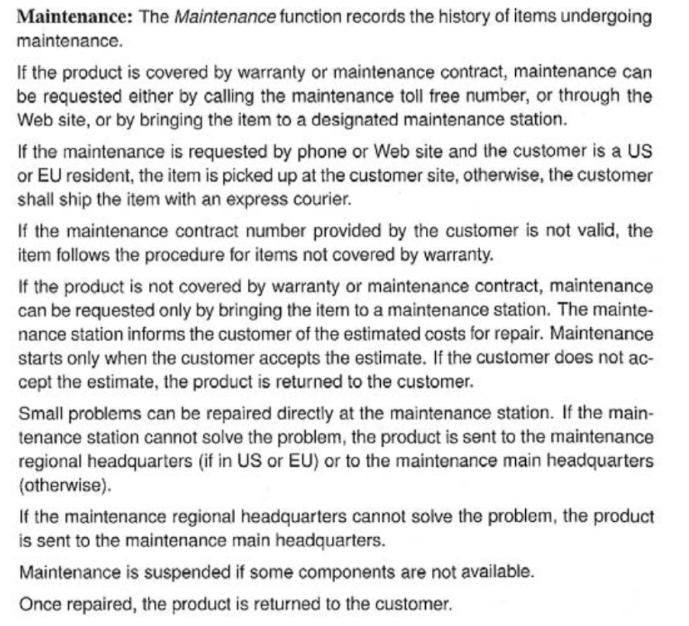
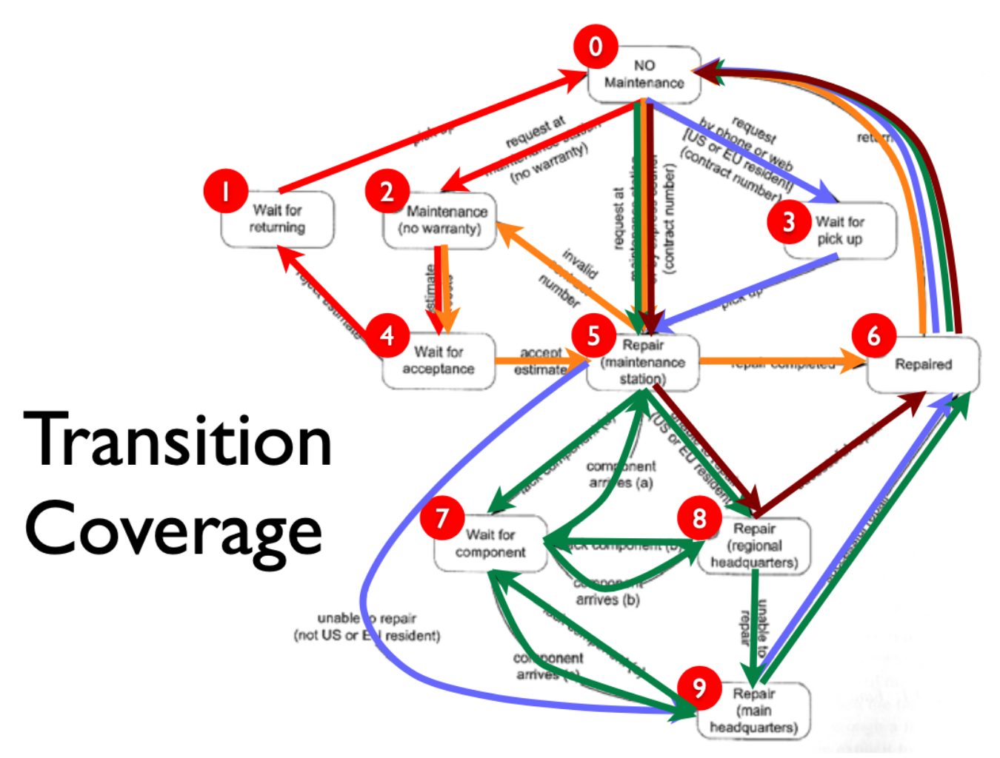
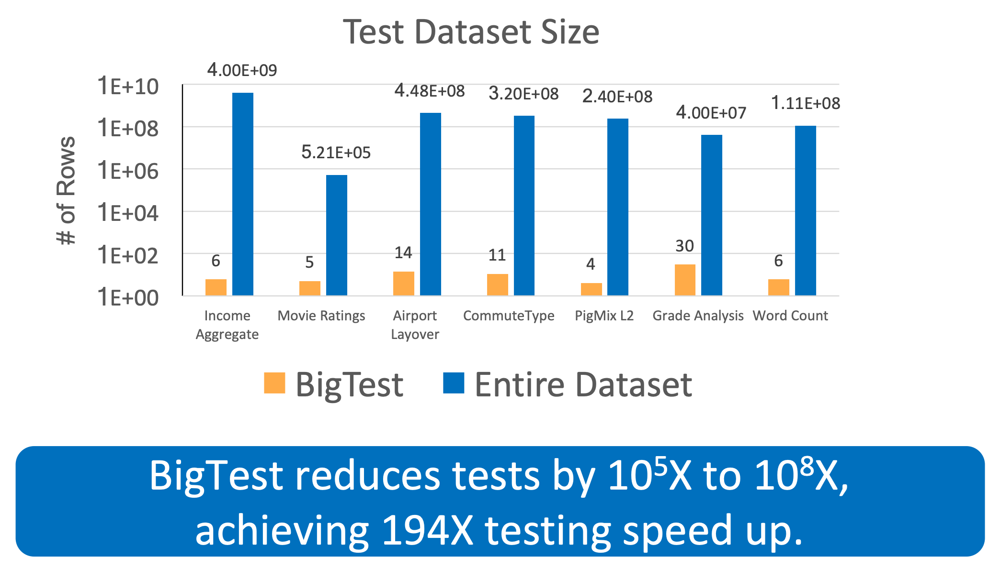

<a name=top>
<a href="http://tiny.cc/seng20"></a>
<hr>
<p>
&nbsp;<a href="https://tiny.cc/seng20">home</a> ::
<a href="https://github.com/txt/se20/blob/master/docs/syllabus.md#top">syllabus</a> ::
<a href="https://github.com/txt/se20/blob/master/docs/syllabus.md#timetable">timetable</a> ::
<a href="https://docs.google.com/spreadsheets/d/1x19m4lmf6eC3pm1l0P-3zHvzySy4ayjUy2AhWp7vrSE/edit#gid=0">groups</a> ::
<a href="https://moodle-courses2021.wolfware.ncsu.edu/course/view.php?id=3873">moodle</a> ::
<a href="http://seng20.slack.com">chat</a>  ::
<a href="https://github.com/txt/se20/blob/master/LICENSE.md#top">&copy; 2020</a>  
<br>
<hr>

# Testing (continued)

## Types of Testing

###  Blackbox:
- Also known as _functional testing_
- Can't look inside the code
- e.g. reflect on input space to find interesting regions
- e..g Look for clusters in the inout or output sace
  - e..g if age runs 0...120
    - try less-than-min, in-range, more-than-max
    - e.g. 1 60 150  
  - e.g. all pairs testing
    - Let the inputs be a vector showing choices per input
      - Find inouts that never use the same pair of values, twice.
    - e.g. three binary inputs, one "days of week"
      and something with a range of 10 inputs
      - e.g. (2 2 2 7 10) 
    - when processed by an
      [_all-pairs_](https://gist.github.com/timm/1c270e6d40715f4f9cfce123eea3badf/archive/a9102cd968e39b89824e669c8caa2f1f2b9f13ba.zip)
       generator   
      `(ipo '(2 2 2 7 10))`  (see below)
    - BTW, all pairs is an amazing heuristic for exploring a large
      space
```lisp
((2 2 1 1 1) ; e.g. (true true true and first value of rest)
 (2 1 2 2 2) (1 2 2 3 3) (1 1 1 4 4) 
 (2 2 2 7 5) (2 2 2 6 6) (2 2 2 5 7) 
 (2 2 2 4 8) (1 1 2 1 9) (1 1 1 7 10)
 (1 1 1 6 5) (1 1 1 5 6) (2 1 1 3 3) 
 (1 2 1 2 2) (2 2 1 7 9) (1 1 1 7 8) 
 (1 1 1 7 7) (0 0 0 7 6)  ; note "0" means "don't care"
 (2 2 2 7 4) (0 0 0 7 3) (0 0 0 7 2) 
 (1 1 2 7 1) (2 2 2 6 10) (0 0 0 6 9) 
 (0 0 0 6 8) (0 0 0 6 7) (0 0 0 6 4) 
 (0 0 0 6 3) (0 0 0 6 2) (0 0 0 6 1)
 (0 0 0 5 10) (0 0 0 5 9) (0 0 0 5 8) 
 (0 0 0 5 5) (0 0 0 5 4) (0 0 0 5 3) 
 (0 0 0 5 2) (0 0 0 5 1) (0 0 0 4 10) 
 (0 0 0 4 9) (0 0 0 4 7) (0 0 0 4 6) 
 (0 0 0 4 5) (0 0 0 4 3) (0 0 0 4 2)
 (0 0 0 4 1) (0 0 0 3 10) (0 0 0 3 9) 
 (0 0 0 3 8) (0 0 0 3 7) (0 0 0 3 6) 
 (0 0 0 3 5) (0 0 0 3 4) (0 0 0 3 2) 
 (0 0 0 3 1) (0 0 0 2 10) (0 0 0 2 9) 
 (0 0 0 2 8) (0 0 0 2 7) (0 0 0 2 6)
 (0 0 0 2 5) (0 0 0 2 4) (0 0 0 2 3) 
 (0 0 0 2 1) (0 0 0 1 10) (0 0 0 1 8) 
 (0 0 0 1 7) (0 0 0 1 6) (0 0 0 1 5) 
 (0 0 0 1 4) (0 0 0 1 3) (0 0 0 1 2))
```


- One trick in black box testing 
  - Read the doc
  - Doodle a model showing expectations
  - Generate tests over that doodle




- Coverage criteria (for finite-state machines)
  - _Test coverage_: cover every path: no feasible due to infinite number of paths (cycles)
  - _State coverage_: every node coverage (minimal testing criterion)
  - _Transition coverage_: every edge covered
    - E.g. here are five tests covering every edge



- Is this still "just" functional testing.

### Blackbox Fuzzing

Dumb Fuzzing :

- Fuzz testing was originally developed by Barton Miller at the University of Wisconsin in 1989.
  - throw random cr\*p at a program till it crashed
  - brute force mutation
- History:
  - 1981: Duran and Ntafos investigated the effectiveness of testing a program with random inputs.
    - Previously: random testing had widely perceived to be worst means of testing
    - Their analysis: random proves are a cost-effective alternative to more systematic testing
  - 1983: Steve Capps developed "The Monkey", a tool that would generate random inputs for classic Mac OS applications, such as MacPaint.
     - The figurative "monkey" refers to the infinite monkey theorem which states that a monkey hitting keys at random on a typewriter keyboard for an infinite amount of time will eventually type out the entire works of Shakespeare. In the case of testing, the monkey would write the particular sequence of inputs that will trigger a crash.

  - 1988: Barton Miller: when he was logged to a modem during a storm, there was a lot of line noise generating junk characters and those characters caused programs to crash
     - New term: _fuzzing = automatically generate random files and command-line parameters 
       for the utility. 
     - The project was designed to test the reliability of Unix programs by executing a large number of random inputs in quick succession until they crashed. 
  - Recently, numerous examples where fuzzing found bugs other approaches missed 
- Simple fuzzing: advantages:
  - Very cheap to generate a test
  - Exploit CPUs to explore a broad range of options
  - Useful for dodging incorrect preconceptions of what the program should do
  - Good for detecting events that lead to  buffer overflow, DOS (denial of service), 
    cross-site scripting and SQL injection
- Simple fuzzing: disadvantages: 
  - It cannot provide a complete picture of the overall security, quality or effectiveness of a program
  - Spends much time generating impossible inputs or very unlikely events

Smarter fuzzing:

- Express input as a grammar 
- Generate from tree
  - Generational fuzzing

```python
US_PHONE_GRAMMAR = {
     "<start>": ["<phone-number>"],
     "<phone-number>": ["(<area>)<exchange>-<line>"],
     "<area>": ["<lead-digit><digit><digit>"],
     "<exchange>": ["<lead-digit><digit><digit>"],
     "<line>": ["<digit><digit><digit><digit>"],
     "<lead-digit>": ["2", "3", "4", "5", "6", "7", "8", "9"],
     "<digit>": ["0", "1", "2", "3", "4", "5", "6", "7", "8", "9"]
}
```

- Example
```
[simple_grammar_fuzzer(US_PHONE_GRAMMAR) for i in range(5)]
['(692)449-5179',
 '(519)230-7422',
 '(613)761-0853',
 '(979)881-3858',
 '(810)914-5475']
```

Mutational fuzzing:

- Take a known valid input
- Mutate it

```python
def mutate(s):
    """Return s with a random mutation applied"""
    mutators = [
        delete_random_character,
        insert_random_character,
        flip_random_character
    ]
    mutator = random.choice(mutators)
    # print(mutator)
    return mutator(s)

for i in range(10):
    print(repr(mutate("A quick brown fox")))

'A qzuick brown fox'
' quick brown fox'
'A quick Brown fox'
'A qMuick brown fox'
'A qu_ick brown fox'
'A quick bXrown fox'
'A quick brown fx'
'A quick!brown fox'
'A! quick brown fox'
'A quick brownfox'
```

Coverage fuzzing

- Track parts of the grammar seen so far
- Fuzz to some new place.

Mining examples to weight crammers:

- Take a library of good examples
- Weight sub-trees on (e.g.) Probability
- Stochastic recursive descent:
  - Stochastically select sub-trees according to their weights
    - If weight = random then generational fuzzing
    - If select to prefer min weights, then coverage fuzzing
  - Recurs into sub tree.

Smarter smarter fuzzing = genetic programming

- We we dynamically adjust weights to prefer certain goals
  - then "testing" becomes AI
  - then "testing" becomes "mitigation" or "optimization"

### Metamorphic testing

XXX

###  Whitebox::

White box: we can open up the code and look inside:

- Coverage criteria (for code)
  - Functions (all functions called once);
    - A very weak test
  - Statement coverage 
    - Supported by many tools
  - du coverage: 
    - find all paths between where a variable is _defined_ and _used_.
  - Branch coverage: 
    - has every condition in the program be explored;
- Warning: you can succeed on all the above, and the code still crashes.

Symbolic execution:
- Find the abstract syntax tree of the code
  - e.g. python3's `ctree` package

```python
import ctree

def f(a):
    for x in range(10):
        a[x] += x

tree1 = ctree.get_ast(f)
ctree.ipython_show_ast(tree1)
```


Applications of symbolic execution:

- Walk the tree to collect the constraints to build the tests. 
- Can lead to spectacular reductions to black box testing
- e.g. BigTest: White-Box Testing of Big Data Analytics [ESEC/FSE 2019]
  - Scripts processing gigabytes of  data sets
  - Is this a hard testing problem?
    - Q: Do the tests have to handle all the possible combinations in the data?
    - A: No: they only need to cover all the branches of the code



## Wy Does testing work

- Most software spent  most of its time within a small number of states
- Druzdel

XXXX

- Bugs are lazy. Clump together. Best predictor of next bug is the last bug.
  GCC clum

It took several decades to find the experience required to build a size/defect relation- ship. In 1971, Fumio Akiyama described the first known “size” law, saying the number of defects D was a function of the number of lines of code; specifically
D = 4.86+0.018⇤loc
Alas, nothing is as simple as that. Lessons come from experience and, as our experience grows, those lessons get refined/replaced. In 1976, Thomas McCabe [290] argued that the number of lines of code was less important than the complexity of that code. He proposed “cyclomatic complexity”, or v(g), as a measure of that complexity and offered the now (in)famous rule that a program is more likely to be defective if:
v(g) > 10
At around the same time, other researchers were arguing that not only is programming an inherently buggy process, its also inherently time-consuming. Based on data from 63 projects, Barry Boehm [37] proposed in 1981 that linear increases in code size leads to exponential increases in development effort:
effort=a⇥KLOCb ⇥Y(Emi ⇥Fi) (1.1) i
Here, a, b are parameters that need tuning for particular projects and Emi are “effort multiplier” that control the impact of some project factor Fi on the effort. For example, if Fi is“analysts capbaility” and it moves from “very low” to “very high”, then accord- ing to Boehm’s 1981 model, Emi moves from 1.46 to 0.71 (i.e. better analysts let you deliver more systems, sooner).

## Testing for Safety crite systems

testing for safety cirtical systems is a different animal. demand u mining isystem. eg. rules for safety critical. small size. on one main loop. if you can find it n 15 seconds go look got it sit safe way

## Formal methods at amaozon

(From [One-Click Formal Methods](http://www0.cs.ucl.ac.uk/staff/b.cook/oneclick.pdf):

- FORMAL METHODS: mathematically based approaches for specifying, building, 
  and reasoning about software. 
- Despite 50 years of research and development, formal methods have had 
  only limited impact in industry. 
- Some in such domains as microprocessor design and aerospace.

Why not widely used?

- _The modeling cost_: 
  Analysts must create a systems model (what is the system)
  and a properties model (what is meant to do). Properties model
  usually much smaller than systems model.
- _The execution cost_: Rigorous analysis of formal properties needs a  full search of  systems model. 
- _The personnel cost:_ Analysts skilled in formal methods must be recruited or trained. 
  Such analysts are generally hard to find and retain.
- _The development brake:_ The above costs can be so high that the requirements must be 
   frozen for some time while we perform the formal analysis. 
   Hence, one of the costs of formal analysis is that it can slow the process of requirements evolution. 

Recent experience at Amazon:

- More and more, web-based systems are configured in sufficient detail 
  - Such that processes can be bounced around from node to node on the cloud (to make best use of spare resources)
  - Application program interfaces (APIs) of cloud services are computer-readable contracts that establish and govern how the system behaves.
    - Most importantly, since those models are utilized by a large user community, 
      - now economically feasible to build the tools needed to verify them
  - Which means that we have enough information to auto-configure our formal methods 
    - and the size of the potential user community and the business value now justifies the cost of formal methods.


## Test Case Priorization

Excessive test:
- Google overdose three bullion
- LN cant ick where tests codm from 


## The Truth About Testing

- "Don’t worry if it doesn’t work right.  If everything did, you’d be out of a job."    
  -  Mosher’s Law of Software Engineering
- "One (person)’s crappy software is another man’s full time job."     
  -  Jessica Gaston
