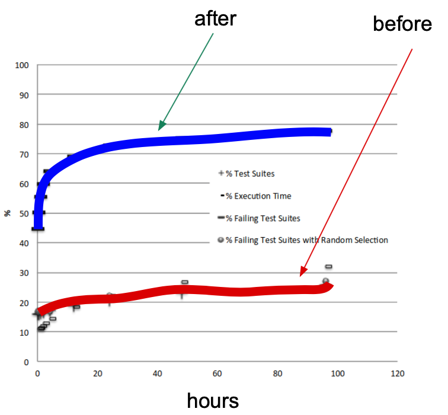
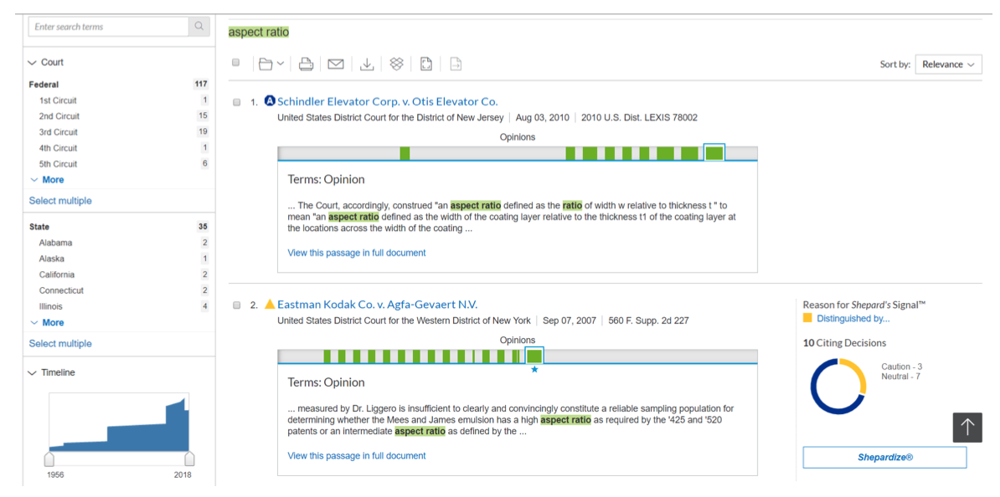
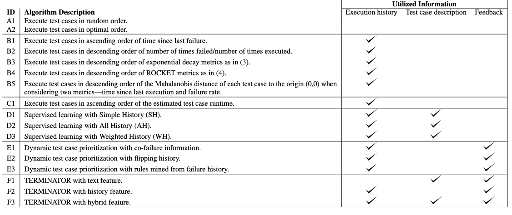
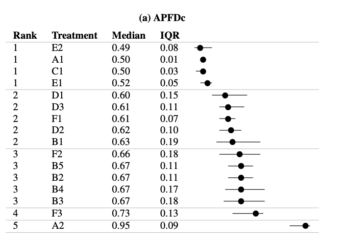
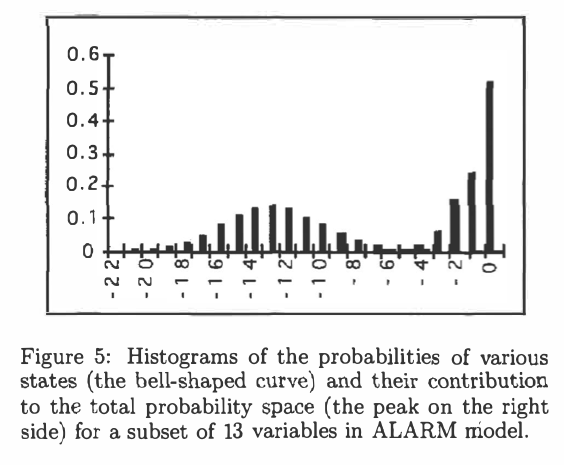
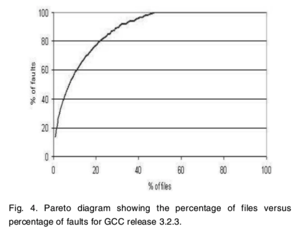

<a name=top>

&nbsp;<a href="https://tiny.cc/seng20">home</a> ::
<a href="https://github.com/txt/se20/blob/master/docs/syllabus.md#top">syllabus</a> ::
<a href="https://github.com/txt/se20/blob/master/docs/syllabus.md#timetable">timetable</a> ::
<a href="https://drive.google.com/drive/folders/1ZFn6H8-4kx5uP34bpFgIFonkz9Tw3nYM?usp=sharing">groups</a> ::
<a href="https://moodle-courses2021.wolfware.ncsu.edu/course/view.php?id=3873">moodle</a> ::
<a href="http://seng20.slack.com">chat</a>  ::
<a href="https://github.com/txt/se20/blob/master/LICENSE.md#top">&copy; 2020</a>  
 

# Testing (the end)
----- 

Breakout session:  January to October 2013,
Google ran 3 billion unit tests on their  global network of machines.
Problems: running out of CPU,  less that 0.5% of those tests ever
failed,  long lags from submission to “passed", developers leaving the organization cause Google was no longer "agile".

Q: So, how to test less?

-----

 

## More on Formal Methods (example)

### "Testing" and Product Lines and Formal Methods

A feature model is a "product line"; i.e. a description of a space 
of products.

Question: what are the _different_ products we can pull from the following?

Now that was a small feature model. Suppose we are talking about something
really big like a formal model of the LINUX kernel with 4000 variables
and 300,000 contrast. Q: How to reason over that space? A: use a theorem prover.
e.g. _Pycosat_.

## Feature Models and Formal Methods

The following example comes from the excellent documentation
at the
[Python Picostat Github page](https://github.com/ContinuumIO/pycosat/blob/master/README.rst)

Let us consider the following clauses, represented using
the DIMACS `cnf <http://en.wikipedia.org/wiki/Conjunctive_normal_form>`_
format::

        p cnf 5 3
        1 -5 4 0
        -1 5 3 4 0
        -3 -4 0

Here, we have 5 variables and 3 clauses, the first clause being

_x1  or not x5 or x4_

Note that the variable x2` is not used in any of the clauses,
which means that for each solution with x2 = True, we must
also have a solution with x2 = False.  In Python, each clause is
most conveniently represented as a list of integers.  Naturally, it makes
sense to represent each solution also as a list of integers, where the sign
corresponds to the Boolean value (+ for True and - for False) and the
absolute value corresponds to i-th variable::

        >>> import pycosat
        >>> cnf = [[1, -5, 4], [-1, 5, 3, 4], [-3, -4]]
        >>> pycosat.solve(cnf)
        [1, -2, -3, -4, 5]

This solution translates to: x1=x5=True,
x2=x3=x4=False

To find all solutions, use `itersolve`::

        >>> for sol in pycosat.itersolve(cnf):
        ...     print sol
        ...
        [1, -2, -3, -4, 5]
        [1, -2, -3, 4, -5]
        [1, -2, -3, 4, 5]
        ...
        >>> len(list(pycosat.itersolve(cnf)))
        18

In this example, there are a total of 18 possible solutions, which had to
be an even number because x2 was left unspecified in the clauses.

The fact that `itersolve` returns an iterator, makes it very elegant
and efficient for many types of operations.  For example, using
the `itertools` module from the standard library, here is how one
would construct a list of (up to) 3 solutions::

        >>> import itertools
        >>> list(itertools.islice(pycosat.itersolve(cnf), 3))
        [[1, -2, -3, -4, 5], 
         [1, -2, -3, 4, -5], 
         [1, -2, -3, 4, 5]]

### Feature Models and Product Lines

[Software installation as a formal methods problem](http://cseweb.ucsd.edu/~lerner/papers/opium.pdf)

Lets represent software dependencies in a logical framework:

If we run Picosat over these formulae then:

- Any solution that satisfies all the constraints...
- Is a different way to create a valid install of the program.

Variants:

- min install: 
   - add a cost to the install effort of each part
   - score everything coming out of `itersolve` (sum that cost)
   - pick the easiest thing to install
- optimizing:
   - generate one solution, ask some human what they think
   - if they don't like, negate it add it to the theorems
   - so future solutions will _not_ contain the thing you don;t like

**Important note:** in practice, except for trivally small 
problems, no one writes DIMACS manually. 

- Instead, we write code to generate DIMACS via some code. 
- For example:
  [running code](https://github.com/ContinuumIO/pycosat/blob/master/examples/opium.py).

## Scale-up Issues

### Scaling up SAT Solvers

In summary, in theory, it is can be useful to reformulate SE tasks as a SAT task. As Micheal Lowry said at a panel at ASE’15:

- It used to be that reduction to SAT proved a prob- lem’s intractability. But with the new SAT solvers, 
  that reduction now demonstrates practicality."

However, in practice, general SAT solvers, such as the Z3, MathSAT [29], vZ  et al., 
are challenged by the complex- ity of real-world software models. For example, the largest benchmark 
for SAT Competition 2017 [31] had 58,000 variables– which is far smaller than (e.g.) the 300,000 
variable problems seen in the recent SE testing literature [4]. 

So SAT solvers are great but as software gets really really big, they need help.

- [Scalable product line configuration: A straw to break the camel's back](https://www.semanticscholar.org/paper/Scalable-product-line-configuration%3A-A-straw-to-the-Sayyad-Ingram/3384176ef4196797603ae2ca68ff353bb4233668)
  Abdel Salam Sayyad, Joseph Ingram, H. Ammar, Tim Menzies
  2013 28th IEEE/ACM International Conference on Automated Software Engineering (ASE)
- [Building Very Small Test Suites (with Snap)](https://arxiv.org/pdf/1905.05358.pdf),
  Jianfeng Chen, Xipeng Shen, Tim Menzies, 2020

### Scaling up TDD

##### Continuous integration at Google

- Continuous change to the code base
- Continuous testing
- January to October 2013
  - Google ran 3 billion unit tests
  - Global network of machines
  - Problems
      - Running out of cpu 
      - less that 0.5% of those tests ever failed
      - Long lags from submission to “passed
- Test case prioritization
  - Select test if (a)new, or (b)recently failed or (c) not recently executed
  - Found more tests that failed, much earlier
  - Greatly reduced time for programmers to get feedback

- Very many prioritization schemes
  - Different according to what information they need
  - [How Different is Test Case Prioritization for Open and Closed Source Projects?](https://arxiv.org/pdf/2008.00612.pdf),
    Xiao Ling, Rishabh Agrawal, and Tim Menzies.

##### Continuous  integration at Lexis Nexis

Large overnight run of all tests.
- when something crashes, there is no link of crash back to line numbers. Pause. What?
- Turns out, there is no information in that.
  - When something crashed, it coes to an off shore team of experts to decide which teams (back in the USA) need to fix
    the bug).

General lesson:
- Need to test  less

- [TERMINATOR: Better Automated UI Test Case Prioritization](https://arxiv.org/pdf/1905.07019.pdf),
  Zhe Yu, Fahmid Fahid, Tim Menzies, Gregg Rothermel, Kyle Patrick, Snehit Cherian,
  (ESEC/FSE ’19, SEIP), August 26–30, 2019, Tallinn, Estonia.

## The Big Question

Q: Why does testing work?
  - A: Software runs in a small part of the total space

Marek Druzdzel, diagnosis
- application for monitoring patients in intensive care. 
- software had 525,312 possible internal states
- the application reached few of them at run time: 
   - one of the states occurred 52 percent of the time, 
   - 49 states appeared 91 percent of the time.

NASA software data: Most faults lie in a small proportion of the files.

- T. Menzies, J. Greenwald and A. Frank, "Data Mining Static Code
Attributes to Learn Defect Predictors," in IEEE Transactions on
Software Engineering, vol. 33, no. 1, pp. 2-13, Jan. 2007, doi:
10.1109/TSE.2007.256941.

AT&T software data: about 80% of the defects come from 20% of the files

- Ostrand et al., “Where the Bugs Are,” Proc. ACM Int’l Symp. Software Testing and Analysis, 2004.

Ditto for the GNU "C" compiler, GCC

- Hamill, Goseva-Popstojanova, Common Trends in Software Fault and Failure Data IEEE TSE, 35(4) 2009

Jospeh Horgan and Aditya Mathur reported in “Software Testing and
Reliability” that testing often exhibits a “saturation effect”;
i.e. most program paths get exercised early with little further
coverage improvement as testing continues. 

- see The Handbook of Software Reliability Engineering, 1996).

As to mutation testing, Christopher Michael found that in 80 to 90\%
of cases, there were no changes in the behavior of a range of
programs despite numerous perturbations on data values using a
program mutator  

- C.C. Michael, ‘On the uniformity of error propagation in software’, Proceedings of the 12th Annual Confererence on Computer Assurance (COMPASS ’97) Gaithersburg, MD, 1997.

So do not poke everything, everywhere 
- Rather, poke around, some
- Where anything starts to fail, 
- Move in for a closer look

Don't believe me? Well...

- Fuzzing... works
- Metamorphic testing... works

But what about safety critical applications?

- Demand vastly simpler code
- Tested using vastly longer testing cycles
- Test generated via a very thorough requirements process.

For more see:
- The Strangest Thing About Software. Available from:
https://www.researchgate.net/publication/2961707_The_Strangest_Thing_About_Software

