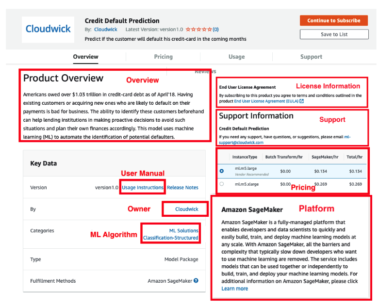
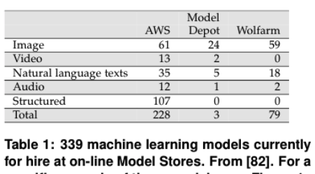
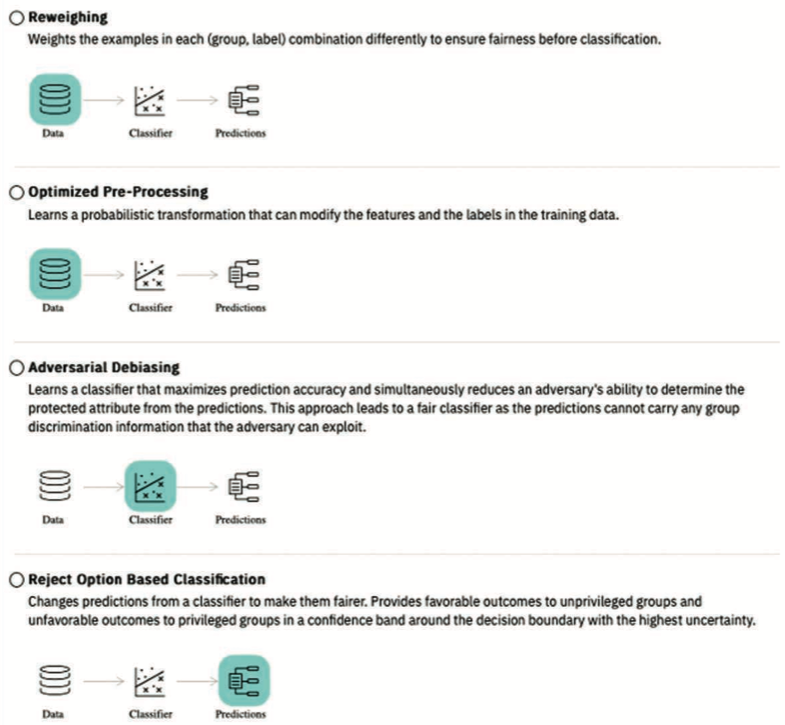

# Ethics
SE is about choice.

- mySQL makefile: 3 billion choices.
- Linux kernel feature map = 7000 variables + 300,000 constraints
  - So very many ways to configure that kernel!


What if those choices have ethical implications?


Maybe, maybe not.

Software has an increasing impact of  modern society. 
- They are used by geologists to predict landslides 
- By biologists working to create a vaccine
for HIV (2)
-  Influence criminal sentencing
- Control autonomous vehicles 
- enable medical advances 
- Algorithmic decision making has entered many high-stakes domains, such as finance, hiring, admissions, criminal justice, and social welfare.

## Unethical Software?

Is it doing so, responsibly and fairly? Maybe not.

- Google’s  sentiment  analyzer  model  which  determines positive
or negative sentiment, gives grossly inappropriate and socially dangerous negative score to sentences like "I
am a Jew", and "I am homosexual"
-  Facial  recognition  software
which  predicts  characteristics  such  as  gender,  age  from
images  has been found to have a much higher error rate for dark-skinned
women  compared  to  light-skinned men
-   A popular photo tagging
app assigns animal category labels to dark skinned people.
- 
Some recidivism assessment models used by the criminal  justice
system  are  more  likely  to  falsely label   black   defendants
as   future   criminals   (at twice the rate as white defendants)
-   Amazon.com stopped using automated recruiting tools after
finding anti-women bias
- Predictive policing software used to deploy police to where they are most likely needed has been found to overestimate crime rates in certain areas without taking into account the 
possibility that more crime is observed there simply because more offibers have been sent there
in the past.

## Model stores

- Machine learning methods can be packaged and executed  in  cloud
“containers”  (e.g.   using  tools  likeopendatahub.io).

- Many  such  containers  are  available for rent, in “Model Stores”
at the AWS marketplace ];the  Wolfram  neural  net  repository
and  the  ModelDepot  [1]  (see  Table  1,  Figure  1).   Users
rent  these models along with the cloud-CPU needed to run them.Then,
they upload their data to the cloud-based learner which later on,
delivers them a model generated by a machine learner.





Model Store models have no tools for (a) detecting
or (b) mitigating discriminatory bias.  
- This is troubling these models are susceptible to
issues of unfairness. 
- That is, using Model Stores, developers can
unwittingly unleash models that are highly discriminatory. 
- Worse
yet, given the ubiquity of the internet, these discriminatory models
could be unleashed on large sections of the general public.


Examples:

- hyScoreis an NLP tool which, amongst other things, performs sentiment
analysis of content.  hyScore accepts  arbitrary  free  form  text
which,  potentially,  could  reference  social  groups  we  might
want  toprotect.
-  Credit Default
Predictor uses 23 attributes include gender, education,age, and
previous history of payments to generate an predictor of the chances
a customer will default on a loan
-  A Hospital Readminission model predicts the probably that a
patient will not be readmitted after discharge.  This model’s
inputs include financial class,  sex and age. Depending  on  the
protected  attributes  a  hospital  may  decide  not  to  release
the  patient  as  the  model shows high probability of readmission,
while another patient with same other attributes but different protected
attribute values can be released


## Handling choice

## How to fix Bias?

### How not to fix

Why not just remove the protected attribute (age, gender,etc)
  - Empirically, does not work
  - We tried it 
  - Almost no change in bias metrics even after that.  
  - Why?
    - attributes are connected
    - so removing on thing still keeps  the bias in the all the others.
    - e.g.  2016, Amazon Prime same day delivery.
    - highly discriminatory against black neighborhood
      - excluded minority neighborhoods in Boston, Atlanta, Chicago, Dallas, New York City, and Washington, D.C., 
      - while extending the service to white neighborhoods  
    - Model trained on "zip code" which can be a surrogate for "race" (given racial separation in many major US cities).
    - Poor observed correlation zip code to race
    - But connected via the labels "good Delvers" "slower Delivery"
      - Data catute jistoricall, over many years.


###  Recognize that bias is  inevitable

-  All data mining is biased
     - without bias, uou can't ignore things
     - without ignoring things, can't prune
     - without pruning, no summarization into a model
     - without a model, can't predict the future
     - So bias makes us blind and bias lets us see
- Some bias is good
  - prefer simple models over complex ones
  - prefer models that suggest fewest changes
  - prefer models that can be quickly updated
- But some bias can get you into trouble
Data contains many models

The "best" model is assesses using criteria C1,C2,C3,C4.... 
- If we build models optimizing for C1,C2 (and ignroethe rest)
- Then it is a random variable whether or not it satisfies C3,C4....
The thing is, all the above a huge assembly of _choices_ made by software engineers. 

### So measure and check for bias

```
  truth   |  
no  | yes | learner
----------------------
TN  | FN  | silent
FP  | TP  | loud
```

Divide data into groups (e.g. divide on gender, age, nationality, anything really)

- Look for differences in those groups:
- EOD= Equal Opportunity Difference:Difference of TruePositive Rates(TP) for unprivileged and privileged groups [40].
- A0D = Average Odds Difference:Average of difference in False Positive (FP) and True Positive (TP) for unprivileged and privileged groups 



- Re weighting: double up or remove certain rows to adjust the results
  - or give each row a magic weight to do the same thing
- Optimized pre-processing:
  - again, magic weights  but this time on al the decisions inside pre-pressing and the learner
  - runs some optimiser to find better weightings.
- Reject options (a post processor)
  - Reweighs predictions to negate known bias
- Adverbial debasing 
  - Mask the protected attribute. 
  - Given  a target class X and a protected attribute Y
    - maximize accuracy for X
    - and minimize accuracy for Y
  - So the learner you use, by definition, knows nothing of Y


Demo: [AI360](https://aif360.mybluemix.net/compare)

## More generally

Software contains choices.

SE people make choices.

SE people can make  bad choices or better choices

Not clear that legal and political institutions are keeping up with the technology choice space in this area.
- So It is up to us.
