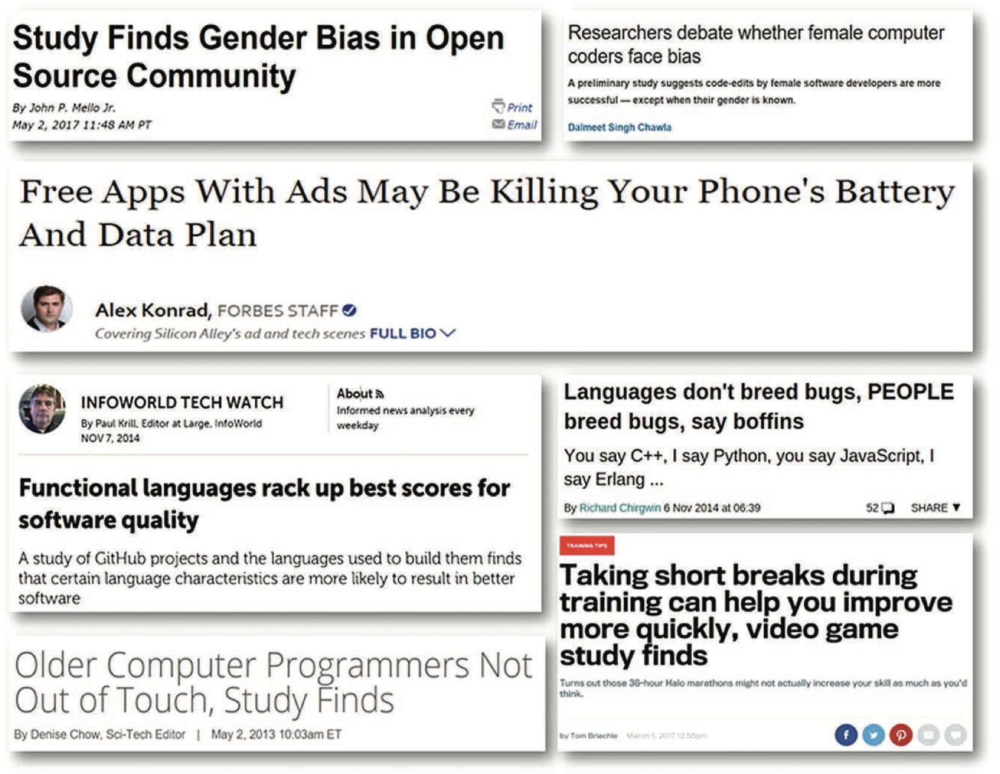
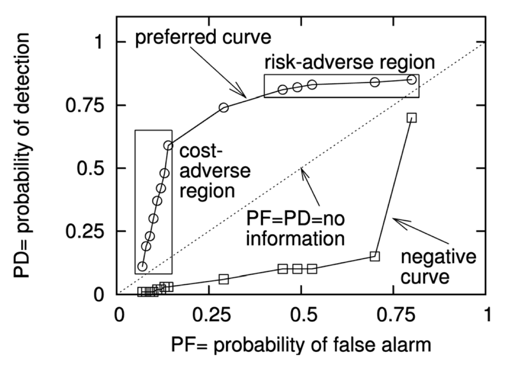
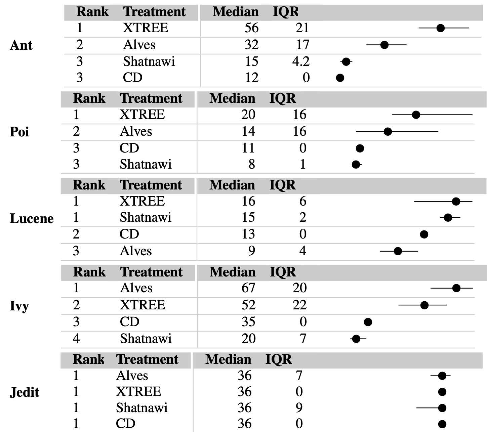

<a name=top>
<a href="http://tiny.cc/seng20"></a>
<hr>
<p>
&nbsp;<a href="https://tiny.cc/seng20">home</a> ::
<a href="https://github.com/txt/se20/blob/master/docs/syllabus.md#top">syllabus</a> ::
<a href="https://github.com/txt/se20/blob/master/docs/syllabus.md#timetable">timetable</a> ::
<a href="https://drive.google.com/drive/folders/1ZFn6H8-4kx5uP34bpFgIFonkz9Tw3nYM?usp=sharing">groups</a> ::
<a href="https://moodle-courses2021.wolfware.ncsu.edu/course/view.php?id=3873">moodle</a> ::
<a href="http://seng20.slack.com">chat</a>  ::
<a href="https://github.com/txt/se20/blob/master/LICENSE.md#top">&copy; 2020</a>
<br>
<hr>

# Software Analytics

<a href="https://www.youtube.com/watch?v=nO6X0azR0nw"></a>


Software development is a complex process:
-  Human developers may not always understand all the factors that influence their projects.
- Software analytics is an excellent choice for discovering, verifying, and monitoring the factors that affect software development.
- Software analytics distills large amounts of low-value data into small chunks of very high-value information
- These chunks reveal the factors matter the most for software projects. For example




Many organizations now pay handsomely to hire large teams of data
scientists. For example, at the time of this writing, there are
1000+ Microsoft employees exploring project data using software
analytics. These teams are performing tasks that, a decade, would
have been called cutting-edge research. But now we call that work
“standard operating procedure”.

Software analytics lets us “trust, but verify” human intuitions:

- If  someone claims that “this or that”  is important for a successful
software project, analytics lets us treat that claim as something
to be verified (rather than a sacred law that cannot be questioned).
- Also, once verified, analytics can act as a monitor to continually
check  if   “this or that” is now overcome by subsequent developments.

Knowing what factors control software projects is very useful since,
sometimes, human do not understand those factors:

-  Anthropologists
studying software projects warn that developers usually develop
their personal  ideas about good and bad software  based on just a
few past projects.
- All too often, these ideas are assumed to be
apply to all projects, rather than just the few seen lately.
-  This
can lead to too much reuse of to many old, and now outdated, ideas.
- A recent study  of 564 software developers found that:
  - <em> “(a) programmers
do indeed have very strong beliefs on certain topics;  (b) their
beliefs are primarily formed based on personal experience, rather
than on findings in empirical research; (c) beliefs can vary with
each project, but do not necessarily correspond with actual evidence.”</em>

Prior to the 21st century, researchers often only had access to data from one or two projects. This meant theories of software development were built from limited data. But in the data-rich 21st century,  researchers have access to all the data they need to test the truisms of the past. And what they’ve found is most surprising:

- In stark contrast to the assumptions of much prior research, pre-and post-release failures not connected (1).
- Static code analyzers no better than simple statistical predictors (2).
- The language construct “goto”, as used in contemporary practice, is rarely considered harmful (3).
- Strongly typed languages are not associated with successful projects (4).
- Developer beliefs are rarely backed by any empirical evidence (5).
- Test-driven development not any better than “test-last” (6).
- Delayed issues are not exponentially more expensive to fix (7).
- Most “bad smells” should not be fixed (8,).

1.   Norman E. Fenton and Niclas Ohlsson. 2000. Quantitative Analysis of Faults and Failures in a Complex Software System. IEEE Trans. Softw. Eng. 26, 8 (August 2000), 797-814. DOI=http://dx.doi.org/10.1109/32.879815
2.   Foyzur Rahman, Sameer Khatri, Earl T. Barr, and Premkumar Devanbu. 2014. Comparing static bug finders and statistical prediction. In Proceedings of the 36th International Conference on Software Engineering (ICSE 2014).
3.   Meiyappan Nagappan, Romain Robbes, Yasutaka Kamei, Éric Tanter, Shane McIntosh, Audris Mockus, and Ahmed E. Hassan. 2015. An empirical study of goto in C code from GitHub repositories. FSE’15.
4.   Baishakhi Ray, Daryl Posnett, Vladimir Filkov, and Premkumar Devanbu. 2014. A large scale study of programming languages and code quality in github. FSE’15.
5.   Prem Devanbu, Thomas Zimmermann, and Christian Bird. Belief & evidence in empirical software engineering. In Proceedings of the 38th International Conference on Software Engineering, pages 108–119. ACM, 2016
6.    D. Fucci, H. Erdogmus, B. Turhan, M. Oivo and N. Juristo, "A Dissection of the Test-Driven Development Process: Does It Really Matter to Test-First or to Test-Last?," in IEEE Transactions on Software Engineering, 43(7), pp. 597-614, 1 2017.
7.   Tim Menzies, William Nichols, Forrest Shull, and Lucas Layman. 2017. Are delayed issues harder to resolve? Revisiting cost-to-fix of defects throughout the lifecycle. Empirical Softw. Engg. 22, 4 (August 2017), 1903-1935. [h]   Krishna, R., Menzies, T., & Layman, L. (2017). Less is more: Minimizing code reorganization using XTREE. Information and Software Technology, 88, 53-66.
8.    Miryung Kim, Thomas Zimmermann, and Nachiappan Nagappan. A field study of refactoring challenges and benefits. . FSE’12 .

## Example Applications

The good news is that, using software analytics, we can correct
those misconceptions. For example, after examining a project, certain
coding styles could be seen as more bug prone (and should be avoided).

Using software analytics, we can correct those misconceptions.  So
many applications of software analytics Here is a longer list of
some of the things studied within software analytics. For more
examples, see [this IEEE Software
Article](https://www.researchgate.net/publication/260649759_Software_Analytics_So_What)
as well as recent conference proceedings of the PROMISE conference,
the Mining Software Repositories (MSR) conference, and any other
conference or journal on software engineering.

As Abram Hindle and colleagues explain:

- <em>“Programming languages, in theory, are complex, flexible and
   powerful, but the programs that real people actually write are
   mostly simple and rather repetitive, and thus they have usefully
  predictable statistical properties that can be captured in statistical
  language models and leveraged for software engineering tasks.”</em>

For example, here  are just some of the many applications in this growing area on research:

- patterns in the tokens of software can recognize  code that is unexpected and bug prone;
- sentiment analysis tools can gauge the mood of the developers, just by reading their issue comments (26).
- clustering tools can explore complex spaces like StackOverflow to automatically detect related questions (27).


-  For one set of projects, software analytics
   could predict 87 percent of code defects, decrease inspection
   efforts by 72 percent and hence, reduces post-release defects
   by 44 percent (23)
- when multiple models are combined using ensemble learning, very good estimates
  can be generated (very low variance in their predictions) and these predictors
   can be  incrementally updated to handle changing condition (24)
- is there too much data for a manual analysis, it is possible to
  automatically analyze data from hundreds to
  thousands of projects using software analytics (25)


-  combining software product information
with apps store data (1,2);
-  using process data to predict overall
project effort (3);
-  using software process models to learn effective
project changes (4);
- using operating system logs that predict software
power consumption (5);
-  exploring product line models to configure
new applications (6);
-  mining natural language requirements to find
links between components (7);
-  mining performance data (8,9);
-  using XML
descriptions of design patterns to recommend particular designs (10);
-  using email lists to understand the human networks inside software
teams (11);
- linking emails to source code artifacts and classifying
their content (12);
- using execution traces to learn normal interface
usage patterns (13);
-  using bug databases to learn defect predictors
that guide inspection teams to where the code is most likely to
fail (14 –16) and to classify changes as clean or buggy (17);
-  using
security data to identify indicators for software vulnerabilities (18);
- using visualization to support program comprehension (19);
-  using
software ontologies to enable natural language queries( 20); and
- mining code clones to assess the implications of cloning and
copy/paste in software (21,22)


1. M. Harman, Y. Jia, and Y. Zhang, “App Store Mining and Analysis: MSR for App Stores,” Proc. Mining Software Repositories, IEEE, 2012, pp. 108–111.
2. I.J.M. Ruiz et al., “Understanding Reuse in the Android Market,” Proc. 20th IEEE Int’l Conf. Program Comprehension (ICPC), IEEE, 2012, pp. 113–122.
3. E. Kocaguneli, T. Menzies, and J. Keung, “On the Value of Ensemble Effort
    Estimation,” to be published in IEEE Trans. Software Eng.; http://menzies.us/pdf/11comba.pdf.
4.  D. Rodríguez et al., “Multiobjective Simulation Optimisation in Software Project Management,” Proc. Genetic and Evolutionary Computation Conf., ACM, 2011, pp. 1883–1890.
5. A. Hindle, “Green Mining: A Methodology of Relating Software Change to Power Consumption,” Proc. Mining Software Repositories, IEEE, 2012, pp. 78–87.
6. A. Salam Sayyad, T. Menzies, and H. Ammar, “On the Value of User Preferences in Search-Based Software Engineering:
   A Case Study in Software Product Lines,” to be published in Proc. Int’l Conf. Software Eng., IEEE CS, 2013.
7. J. Huffman Hayes et al., “Advancing Candidate Link Generation for Require-ments Tracing: The Study of Methods,” IEEE Trans. Software Eng., vol. 32, no. 1, 2006, pp. 4–19.
8. Z. Ming Jiang et al., “Automated Performance Analysis of Load Tests,” Proc. Intl. Conf. Software Maintenance, IEEE, 2009, pp. 125–134.
9. S. Han et al., “Performance Debugging in the Large via Mining Millions of Stack Traces,” Proc. Int’l Conf. Software Eng., IEEE CS, 2012, pp. 145–155.
10. F. Palma, H. Farzin, and Y.-G. Gueheneuc, “Recommendation System for Design Patterns in Software Development: A DPR Overview,” Proc. 3rd Int’l Workshop
   Recommendation Systems for Software Eng., IEEE, 2012, pp. 1–5.
11. C. Bird et al., “Mining Email Social Networks,” Proc. Mining Software Repositories, ACM, 2006, pp. 137–143.
12. A. Bacchelli et al., “Content Classification of Development Emails,” Proc. Int’l Conf. Software Eng., IEEE CS, 2012, pp. 375–385.
13. N. Gruska, A. Wasylkowski, and A. Zeller, “Learning from 6,000 Projects: Lightweight Cross-Project Anomaly Detection,” Proc. 19th Int’l Symp. Software Testing and Analysis (ISSTA), ACM, 2010, pp. 119–130. 14. T. Men
14. T. Menzies, J. Greenwald, and A. Frank, “Data Mining Static Code  Attributes to Learn Defect Predictors,” IEEE Trans. Software Eng., Jan. 2007; http://menzies.us/pdf/06learnPredict.pdf.
15. T.J. Ostrand, E.J. Weyuker, and R.M. Bell, “Where the Bugs Are,” Proc. 2004 ACM SIGSOFT Int’l Symp. Software Testing and Analysis, ACM, 2004, pp. 86–96.
16. S. Kim et al., “Predicting Faults from Cached History,” Proc. Int’l Conf. Software Eng., IEEE CS, 2007, pp. 489-498.
17. S. Kim, E.J. Whitehead Jr., and Y. Zhang, “Classifying Software Changes: Clean or Buggy?,” IEEE Trans. Software Eng., vol. 34, no. 2, 2008, pp. 181–196.
18. Y. Shin et al., “Evaluating Complexity, Code Churn, and Developer Activity Metrics as Indicators of Software Vulnerabilities,” IEEE Trans. Software Eng.,
    vol. 37, no. 6, 2011, pp. 772–787.
19. R. Wettel, M. Lanza, and R. Robbes, “Software Systems as Cities: A Controlled Experiment,” Proc. Int’l Conf. Software Eng., IEEE CS, 2011, pp. 551–560.
20. M. Würsch et al., “Supporting Developers with Natural Language Queries,” Proc. Int’l Conf. Software Eng., IEEE CS, 2010, pp. 165–174.
21. M. Kim et al., “An Empirical Study of Code Clone Genealogies,” Proc. European Software Eng. Conf., ACM, 2005, pp. 187–196.
22. C. Kapser and M.W. Godfrey, “Cloning Considered Harmful,” Proc. Working Conf. Reverse Eng., IEEE, 2006, pp. 19–28
23. Misirli et al. “AI-Based Defect Predictors: Applications and Benefits in a Case Study”, AI Magazine June 2011
24. Minku, L. L., & Yao, X. (2013). Ensembles and locality: Insight on improving software effort estimation. Information and Software Technology, 55(8), 1512-1528
25. R. Krisha, A. Agrawal, A. Rahman, A. Sobran, T.Menzies, What is the Connection Between Issues, Bugs, and Enhancements?
    (Lessons Learned from 800+ Software Projects), ICSE-SEIP, 2018
26. Alessandro Murgia, Parastou Tourani, Bram Adams, and Marco Ortu. 2014. Do developers feel emotions? an exploratory analysis of emotions in software artifacts. MSR’14
27. B. Xu, D. Ye, Z. Xing, X. Xia, G. Chen and S. Li, "Predicting semantically linkable knowledge in developer online forums via convolutional neural network,"  ASE’16


## Cheat's Guide to Analytics

### Evaluation Metrics (for Numeric  Classes)

- predicted = p
- actual = a
- RE = releative error = abs(p - a)/a
- MRE = mean RE = sum( abs(p - a)/a ) / N
- Median RE = sort all numbers, take the number in the middle

### Evaluation Metrics (for Discrete Classes)

```
    truth     |  
no    | yes   | learner
------|-------|-------
a=TN  | c=FN  | silent
b=FP  | d=TP  | loud
```

- accuracy : (a+d) / (a+b+c+d)
- precision : how many of the predicted are right : d/(b+d)
- recall : how many we found d/(c+d)
- false alarm : b/(a+b)

When the target class is rare (c+d) << (a+b) then

- Accuracy isn't accurate: in the following accuracy = 98% and  recall = 33%
- Precision isn't precise: precision = 100% (but we are still missing 33% of the data).

```
    truth     |  
no    | yes   | learner
------|-------|-------
a=97  | c=2   | silent
b=0   | d=1   | loud
```

You can't always get what you want
- More recall means more false alarm
  - If you cover everything, you'll catch some mistakes
  - If you make no mistakes, you won't cover a thing



- The nature of the data controls what we can learn
  from it.
    - neg/pos = (a + c) / (b + d)
    - prec= d / (d + c) 
    - Divide top and bottom by D:
      - p = 1 / (1 + c/d)
      - p = 1 / (1 + neg / pos \* pf / recall ) 
      - which can be rearranged to:
        - pf = pos / neg \* ( (1- prec) / prec ) \* recall
      


### Temporal-Validation

Sort data into time (releases), train on six prior releases,
test on the latest one


### Cross-Validation

- M times, reorder data (remove spurious order effects)
  - N times divide into B bins
    - For b in B bins
      - For learner Learner1, Learner2, Learner3,....
        - Training: Model = Learner(Data - Bins[b])
        - Test: apply Model to Bins[b]
- "Stratified" CVV:
  - mimic distributions of all data within the test suites
- "Synthetic training":
  - SMOTE
    - Balance the distributions in the ttrain data
     - Never mess with the test data.
       - But do anything you like with the training data
    - Down sample (prune) the majority class at random
    - Up sample (make stuff up) the minoritty class
      - For each minority example EG
        - From K nearest neighbors
          - Pick X at random
          - Make up something (interpolate between X and EG)

### Statistical Analysis

- For N=M=5, this generates 25 numbers for each Learner
  - e.g. Learner1's recall 
    - L1 = (81,81,82,84.85,85,86,87,88,88,89,89,89,90,90,91,91,92,92,93)
  - e.g. Learner2's recall 
    - L2 = (70,71,73,74,75,76,76,76,77,78,78,79,79,70,81,81,82,84.85,85)
  - So now you need stats to compare different learners L1, L2
  - Distinguishable (pick  any number from L1: can you tell it belongs to L1 or L2)?
    - Also called a "significance test" for some strange reason
    - If the variances are large, hard to distinguish
  - Small effect (is the middle of L1  too close to L2?)
  - One learner is different than another:
    - if is _distinguishable_ by more than a _small effect_?
    - Parametric tests faster, easier, but more naive than non-parametric tests

|significance (distinguishable)| effect size  | code                                                                        | notes                                 |
|------------------------------|--------------|-----------------------------------------------------------------------------|---------------------------------------|
|t-test                        | hedges       |[stats.py](https://gist.github.com/timm/33578871be53e604da83679dc7ccbcc5)    | "parametetic" (assumes "normal" data) | 
|bootstrap                     | cliffs-delta | [sk.py](https://gist.github.com/timm/41b3a8790c1adce26d63c5874fbea393)      | "non-parametric"                      |

- Scott knott test
  - Sort learners by their median score
  - N = size(learners)
  - Seek  m that  most (\*) divides the data into most different regions (diff=distinguishable+small effect)
    - If none, left everyone gets the same rank
    - Else break the data, left and right, recurs on each half

(\*) Givens cores on N learners, find argmax V:
- For m= 2 to N
  - left = learners[:m]
  - right = learners[m:]
  - mu0, mu1, mu2 = mean(all), mean(left), mean(right)
  - if left and right distinguishable by more than a small effect
    - V = m/N \* abs(mu1 - mu0)<sup>2</sup> + (N-m)/N \* abs(mu2 - mu0)<sup>2</sup>



Note "blurring" (15==12, 11==8,16==15)


[Bigger example (a nearest neighbor calculation)](https://docs.google.com/spreadsheets/d/1AfL5C6aXcaaiX8KtcNZEwvnDtbw1vIrX18HIbJJknJs/edit?usp=sharing)


## Futures

- _Green engineering:_  Fancy cellphones become hunks of dead plastic if they run out of power.
  Hence, taming power consumption is now a primary design concern.

- Another emerging area is _social patterns in software engineering_.
  - Our society grants different authority to different groups in
society.
  - Those biases transfer to software projects and software
products (1).
  - By   adopting the perspectives of different social
groupings, it is possible to build better software (2).
  - Models built from social factors (like how rarely someone updates part of the
code) can be more effective for predicting code quality prediction
than  code factors  (like  function size or number of arguments).
For example, when studying software built in multiple countries, a
good predictor for bugs is the complexity of the organizational chart
 (least bugs are introduced when people working on the same functions
 report to the same manager, even if they are in different countries) (3)
- Software analytics also studies the interactions of developers using biometric sensors.
  - Just as we mine software (and the social processes that develop them), so too can we
    mine data, collected at the millisecond level, from computer programmers.
    For example, using eye-tracking software or sensors for skin and brain activity,
    software analytics can determine what code is important or most difficult for developers (4).
- When trading-off different goals, the  data mining algorithms used in conventional software engineering
  often use hard-wired choices.
  - These choices may be irrelevant or even antithetical to the concerns of the business
    users who are funding the analysis.
  - For example, one way to maximize accuracy in unbalanced data sets (where, say,
    most of the examples are not defective) is to obsess on maximizing the true negative score.
  - This can mean that, by other measures such as precision or recall, the learner fails.
  - What is required are “learners” that guide the reasoning according to  user-specified goal.
  - Such “search-based software engineering” tools can implement other useful tasks such as
     automatically tuning the control parameters of a data mining algorithm (which, for most
     developers, is a black art).
- Privacy and security are issues.
  - Legislation being enacted around the world (e.g., the European General Data Protection Regulation, GDPR)
    means that vendors collecting data will face large fines unless they address privacy concerns.
   - One way to privatize data is to obfuscate it (a.k.a. mutate it) in reduce the odds that an malevolent
    agent can identify who or what generated that data.
   -  But this raises a problem- the more we mutate data, the harder it becomes to learn an
     effective model from it.  Recent results suggest  that sometimes this problem can be solved,
     but much more work is required on how to share data  without compromising confidentialityi (5).
- Once someone can apply data mining algorithms to their data, they
can now build and ship innovative AI tools. While sometimes those
tools solve SE problems (e.g. recommending what to change in source
code), they can can also be used on a wider range of problems.
That is, we see software analytics as the training ground for the
next generation of AI-literate software engineer working on
applications such as   image recognition; large-scale text mining;
autonomous cars or drones; etc.


1. Sainyam Galhotra, Yuriy Brun, and Alexandra Meliou, Fairness Testing: Testing Software for Discrimination, in European Software Engineering Conference and ACM SIGSOFT Symposium on the Foundations of Software Engineering (ESEC/FSE), pages 498-510, Paderborn, Germany, September 2017.
2. Burnett, Margaret, Simone Stumpf, Jamie Macbeth, Stephann Makri, Laura Beckwith, Irwin Kwan, Anicia Peters, and William Jernigan. "GenderMag: A method for evaluating software's gender inclusiveness." Interacting with Computers 28, no. 6 (2016): 760-787.
3. Bird C, Nagappan N, Devanbu PT, Gall HC, Murphy B. Does distributed development affect software quality? An empirical case study of Windows Vista. In: Proceedings of the 31st international conference on software engineering, ICSE 2009, May 16–24. Vancouver, Canada
4. Thomas Fritz, Andrew Begel, Sebastian C. Müller, Serap Yigit-Elliott, and Manuela Züger. 2014.
   Using psycho-physiological measures to assess task difficulty in software development.
   In Proceedings of the 36th International Conference on Software Engineering (ICSE 2014). ACM,
   New York, NY, USA, 402-413. DOI: https://doi.org/10.1145/2568225.2568266
5. Li, Z., Jing, X. Y., Zhu, X., Zhang, H., Xu, B., & Ying, S. (2017). On the Multiple Sources and Privacy Preservation Issues for Heterogeneous Defect Prediction. IEEE Transactions on Software Engineering.


