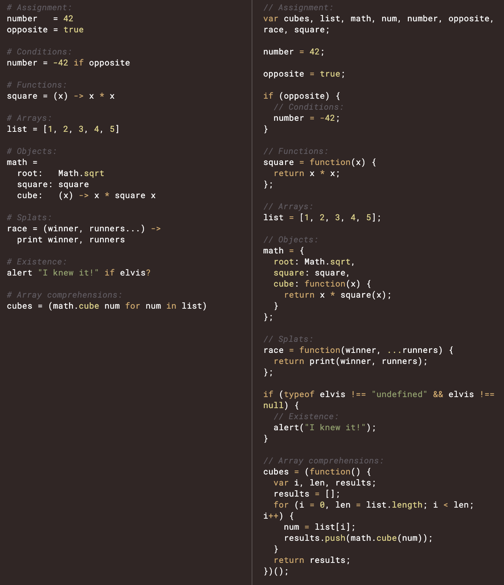

<a name=top>
<a href="http://tiny.cc/seng20"></a>
<hr>
<p>
&nbsp;<a href="https://tiny.cc/seng20">home</a> ::
<a href="https://github.com/txt/se20/blob/master/docs/syllabus.md#top">syllabus</a> ::
<a href="https://github.com/txt/se20/blob/master/docs/syllabus.md#timetable">timetable</a> ::
<a href="https://drive.google.com/drive/folders/1ZFn6H8-4kx5uP34bpFgIFonkz9Tw3nYM?usp=sharing">groups</a> ::
<a href="https://moodle-courses2021.wolfware.ncsu.edu/course/view.php?id=3873">moodle</a> ::
<a href="http://seng20.slack.com">chat</a>  ::
<a href="https://github.com/txt/se20/blob/master/LICENSE.md#top">&copy; 2020</a>  
<br>
<hr>

XXX to dao. add memoing and my memos trick

# Programming Languages and Abstraction

## LISP

Consider a minimal programming language with just a few primitives, plus a macro
language for assembling those primitives into more complex reasoning.
- Build mappings from primitives down to hardware
  - Port those  small number of mappings to many platform
- Let programmers work up from the primitives.

Enter LISP:


[LISP](https://www.youtube.com/watch?v=HM1Zb3xmvMc), its the source

- 1955: LISP: a minimal virtual machine. Code these (small set of primitives) on any hardware
  you like then, on top of all that, code written in LISP runs everywhere

(Aside:   Well, not really. 
- Turns out, code does more than "computes". 
  - It also "connects" (to GUIs, databases, networks)
  - It also "explores"; i.e. Cognitive support for humans  
    exploring the world with software.
- But we'll get back to that.)


[Paul Graham](http://www.paulgraham.com/rootsoflisp.html)
  - "In 1960, John McCarthy published a remarkable paper in which he did for programming something like what Euclid did for geometry. He showed how, given a handful of simple operators and a notation for functions, you can build a whole programming language. He called this language Lisp, for "List Processing," because one of his key ideas was to use a simple data structure called a list for both code and data."
- [Do not read](https://web.archive.org/web/20131004232653/http://www-formal.stanford.edu/jmc/recursive.pdf)
  MacCarthy, 1960, "Recursive Functions of Symbolic Expressions and Their Computation by Machine, Part I"
- Here's a [Better](https://sep.yimg.com/ty/cdn/paulgraham/jmc.ps?t=1595850613&) read

Here's a LISP interpreter written in LISP:

```lisp
; The Lisp defined in McCarthy's 1960 paper, translated into CL.
; Assumes only quote, atom, eq, cons, car, cdr, cond.
; Bug reports to lispcode@paulgraham.com.

(defun null. (x)
  (eq x '()))

(defun and. (x y)
  (cond (x (cond (y 't) ('t '())))
        ('t '())))

(defun not. (x)
  (cond (x '())
        ('t 't)))

(defun append. (x y)
  (cond ((null. x) y)
        ('t (cons (car x) (append. (cdr x) y)))))

(defun list. (x y)
  (cons x (cons y '())))

(defun pair. (x y)
  (cond ((and. (null. x) (null. y)) '())
        ((and. (not. (atom x)) (not. (atom y)))
         (cons (list. (car x) (car y))
               (pair. (cdr x) (cdr y))))))

(defun assoc. (x y)
  (cond ((eq (caar y) x) (cadar y))
        ('t (assoc. x (cdr y)))))

(defun eval. (e a)
  (cond
    ((atom e) (assoc. e a))
    ((atom (car e))
     (cond
       ((eq (car e) 'quote) (cadr e))
       ((eq (car e) 'atom)  (atom   (eval. (cadr e) a)))
       ((eq (car e) 'eq)    (eq     (eval. (cadr e) a)
                                    (eval. (caddr e) a)))
       ((eq (car e) 'car)   (car    (eval. (cadr e) a)))
       ((eq (car e) 'cdr)   (cdr    (eval. (cadr e) a)))
       ((eq (car e) 'cons)  (cons   (eval. (cadr e) a)
                                    (eval. (caddr e) a)))
       ((eq (car e) 'cond)  (evcon. (cdr e) a))
       ('t (eval. (cons (assoc. (car e) a)
                        (cdr e))
                  a))))
    ((eq (caar e) 'label)
     (eval. (cons (caddar e) (cdr e))
            (cons (list. (cadar e) (car e)) a)))
    ((eq (caar e) 'lambda)
     (eval. (caddar e)
            (append. (pair. (cadar e) (evlis. (cdr e) a))
                     a)))))

(defun evcon. (c a)
  (cond ((eval. (caar c) a)
         (eval. (cadar c) a))
        ('t (evcon. (cdr c) a))))

(defun evlis. (m a)
  (cond ((null. m) '())
        ('t (cons (eval.  (car m) a)
                  (evlis. (cdr m) a)))))
```


- Here's a [much, much better](https://norvig.com/lispy.html)
  - Sooo much fun
- Lisp = computation = rewrite terms
    - there are atoms (symbols, numbers or nil or `t`, aka "true")
    - and there are lists (which contain atoms of lists)
    - 'a ==> a
    - `(eq x y)` is the same or both nil
      - `(car '(a b c))` ==> `a` ; i.e. pull the head
      - `(cdr '(a b c))` ==> `(b c)` ; i.e. pull the rest
    - `(cons 'x '(y z))` ==> `(x y z)` ; i.e. assemble something
    - `(cond (if1 do1) (if2 do2) ..)`  ; i.e. branch the reasoning
  - "Functions" and _lambda bodies_ `((lambda (p1 p2 p3..) e)  a1 a2 a3...)`
    - set `p1 p2 p3...` to the values of the arguments `a1 a2 a3...`
    - then evaluate  `e`.
    - Note that lambda bodies are just lists (so we can build them up and pull them down with `car` `cdr` `cons` just
      like anything ese
    - When we "define a function", we add a "lambda body" to the  "environment"
  - "Environments" and lists of pairs of symbol binding
    - `'((a 1) (b 2) ...)`
    - When enter a lambda body, we add parameter arguments to the _left_ hand side:
      -  `((p1 a1) (p2 a2) (p3 a3) (a 1) (b 2) ...)`
      - Look up local values left to right, local recursive vars shadow parent vars
        - So now we can recursion.

```lisp
is.py> (define circle-area (lambda (r) (* pi (* r r))))
lis.py> (circle-area 3)
28.274333877
lis.py> (define fact (lambda (n) 
              (if (<= n 1) 
            1 
      (* n 
         (fact (- n 1))))))
lis.py> (fact 10)
3628800
lis.py> (fact 100)
9332621544394415268169923885626670049071596826438162146859296389521759999322991
5608941463976156518286253697920827223758251185210916864000000000000000000000000
lis.py> (circle-area (fact 10))
4.1369087198e+13
lis.py> (define first car)
lis.py> (define rest cdr)
lis.py> (define count (lambda (item L) 
            (if L 
                (+ (equal? item (first L)) 
                   (count  item (rest L))) 
                0)))
lis.py> (count 0 (list 0 1 2 3 0 0))
3
lis.py> (count (quote the) (quote (the more the merrier the bigger the better)))
4
lis.py> (define twice (lambda (x) (* 2 x)))
lis.py> (twice 5)
10
lis.py> (define repeat (lambda (f) 
                          (lambda (x) 
                              (f (f x)))))
lis.py> ((repeat twice) 10)
40
lis.py> ((repeat (repeat twice)) 10)
160
lis.py> ((repeat (repeat (repeat twice))) 10)
2560
lis.py> ((repeat (repeat (repeat (repeat twice)))) 10)
655360
lis.py> (pow 2 16)
65536.0
lis.py> (define fib (lambda (n) 
               (if (< n 2)
                   1 
                  (+ (fib (- n 1)) 
                     (fib (- n 2))))))
lis.py> (define range (lambda (a b) 
                           (if (= a b) 
                               (quote ()) 
                               (cons a 
                                     (range (+ a 1) 
                                            b)))))
lis.py> (range 0 10)
(0 1 2 3 4 5 6 7 8 9)
lis.py> (map fib (range 0 10))
(1 1 2 3 5 8 13 21 34 55)
lis.py> (map fib (range 0 20))
(1 1 2 3 5 8 13 21 34 55 89 144 233 377 610 987 1597 2584 4181 6765)
```  

LISP was crazy popular and remains very influential
- And LISP ideas are constantly being added to other programming languages
  - Paul Graham: 
    "It's worth understanding what McCarthy discovered, 
    not just as a landmark in the history of computers, but as a 
      model for what programming is tending to become in our own time. 
    It seems to me that there have been two really clean, consistent models of programming so far: the C model and the Lisp model. These two seem points of high ground, with swampy lowlands between them. As computers have grown more powerful, the new languages being developed have been moving steadily toward the Lisp model. A popular recipe for new programming languages in the past 20 years has been to take the C model of computing and add to it, piecemeal, parts taken from the Lisp model, like runtime typing and garbage collection."
- Not until Julia, did I ever see a macro system as good as 
  that in LISP.
- And what about multi-methods?

```lisp
;;; numeric columns -----------------------------
(defmethod add1 ((self num) (x string)) 
  "Handling strings from text files 
   where 'x' is not a number yet."
  (add1 self (read-from-string x)))

(defmethod add1 ((self num) (x number))
  "Knuth's algorithm for incrementally 
   updating lo, hi, mu, sd."
  (with-slots (n mu m2 hi lo sd) self
    (let ((d (- x mu)))
      (if (> x hi) (setf hi x))
      (if (< x lo) (setf lo x))
      (incf mu (float (/ d n)))
      (incf m2 (float (* d (- x mu))))
      (setf sd 
            (cond ((< m2 0) 0)
                  ((< n 2) 0)
                  (t (sqrt (/ m2 (- n 1))))))))
  x)
```

Vendor wars killed LISP
- When Peter Norvig went to Google, he had to recommend  
  Python, not LISP, since even  decades after its invention 
  there was still no platform independent GUI.
- Still, for a good time, install SBCL and have fun

XXXX python lambda dby example

## Smalltalk


- 1974 Smalltalk VM
  - Its the source man
  - Invented bit-mapped graphics, multi-windows environment,
    pure OO prorgramming
  - Significantly advanced the art of garbage collection, virtual machines
  - [Smalltalk-80 in a TV show](https://www.youtube.com/watch?v=AuXCc7WSczM)
  - [Smalltalk article 1980](http://dreammachin.es/Kay_SciAm_77.pdf)
  - Later on, was used to design the Java VM 
    - Q: Why does JAVA have single parent inheritance? 
    - A: Cause of Smalltalk

Smalltalk class hierarchy (somewhere in the 1980s):


```
Object
|    Behavior
|    |    ClassDescription
|    |    |    Class
|    |    |    Metaclass
|    BlockClosure
|    Boolean
|    |    False
|    |    True
|    Browser
|    Collection
|    |    Bag
|    |    MappedCollection
|    |    SequenceableCollection
|    |    |    ArrayedCollection
|    |    |    |    Array
|    |    |    |    ByteArray
|    |    |    |    WordArray
|    |    |    |    LargeArrayedCollection
|    |    |    |    |    LargeArray
|    |    |    |    |    LargeByteArray
|    |    |    |    |    LargeWordArray
|    |    |    |    CompiledCode
|    |    |    |    |    CompiledMethod
|    |    |    |    |    CompiledBlock
|    |    |    |    Interval
|    |    |    |    CharacterArray
|    |    |    |    |    String
|    |    |    |    |    |    Symbol
|    |    |    LinkedList
|    |    |    |    Semaphore
|    |    |    OrderedCollection
|    |    |    |    RunArray
|    |    |    |    SortedCollection
|    |    HashedCollection
|    |    |    Dictionary
|    |    |    |    IdentityDictionary
|    |    |    |    |    MethodDictionary
|    |    |    |    RootNamespace
|    |    |    |    |    Namespace
|    |    |    |    |    SystemDictionary
|    |    |    Set
|    |    |    |    IdentitySet
|    ContextPart
|    |    BlockContext
|    |    MethodContext
|    File
|    |    Directory
|    FileSegment
|    Link
|    |    Process
|    |    SymLink
|    Magnitude
|    |    Association
|    |    Character
|    |    Date
|    |    LargeArraySubpart
|    |    Number
|    |    |    Float
|    |    |    Fraction
|    |    |    Integer
|    |    |    |    LargeInteger
|    |    |    |    |    LargeNegativeInteger
|    |    |    |    |    LargePositiveInteger
|    |    |    |    |    |    LargeZeroInteger
|    |    |    |    SmallInteger
|    |    Time
|    Memory
|    Message
|    |    DirectedMessage
|    MethodInfo
|    Point
|    ProcessorScheduler
|    Rectangle
|    Signal
|    |    Exception
|    |    |    Error
|    |    |    |    Halt
|    |    |    |    |    ArithmeticError
|    |    |    |    |    |    ZeroDivide
|    |    |    |    |    MessageNotUnderstood
|    |    |    |    UserBreak
|    |    |    Notification
|    |    |    |    Warning
|    Stream
|    |    ObjectDumper
|    |    PositionableStream
|    |    |    ReadStream
|    |    |    WriteStream
|    |    |    |    ReadWriteStream
|    |    |    |    |    ByteStream
|    |    |    |    |    |    FileStream
|    |    Random
|    |    TextCollector
|    |    TokenStream
|    UndefinedObject
|    ValueAdaptor
|    |    NullValueHolder
|    |    PluggableAdaptor
|    |    |    DelayedAdaptor
|    |    ValueHolder
```


## JavaScript

- ECMA
  - In September 1995, a Netscape programmer named Brandan Eich developed a new scripting language in just 10 days. 
    - Clinet-side intra-interpreter language
      - a Virual machine in every borwser
    - Why so fast? Cause its theoretical foundations were well defined... in LISP.
  - It was originally named Mocha, but quickly became known as LiveScript and, later, JavaScript.

- ERLANG, ELIXR

## Transpilers

- Transpilers
  - Why write a new language? Why not just convert your source code into some other language
    - e.g. CoffeeScript into JavaScript



but with transpilers: where are the line numbers:w
