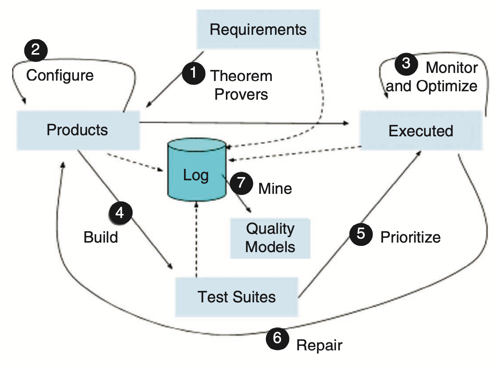
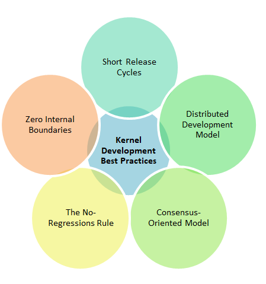

<a name=top>

&nbsp;<a href="https://tiny.cc/seng20">home</a> ::
<a href="https://github.com/txt/se20/blob/master/docs/syllabus.md#top">syllabus</a> ::
<a href="https://github.com/txt/se20/blob/master/docs/syllabus.md#timetable">timetable</a> ::
<a href="https://moodle-courses2021.wolfware.ncsu.edu/course/view.php?id=3873">moodle</a> ::
<a href="http://seng20.slack.com">chat</a>  ::
<a href="https://github.com/txt/se20/blob/master/LICENSE.md#top">&copy; 2020</a>  
 

# Project 1

Goal1: start something that another groups will say
"yes, for Project2, we want to finish that".

Goal2: (much harder) start something  another groups will say
"yes, for Project3, we know how to evaluate if that does something
better than something else".

## Start by Picking  a Project

(Hint: do it now!)

Pick something. Code it in any language using any tools you like. But

- everyone on the team has to use the same tools
- all the work has to be shared via Github (public repos, general GH-- not NCSU):

What to do? Well pick something:

- Cool: 
  - Cause you have to impress;
- Ambitious:
  -  Cause you are here to make mistakes
- Not too ambitious:
  - So you cannot make significant progress in 5 weeks;
- Not too small: 
  - So you can  impress people with the work;
- Small enough:
  - So you can finish;
- Where there is something already running:
  - So you get going fast;
- Something the whole team can contribute to
  - Work in  a language that everyone in the team can handle:
  - Work on a problem everyone can understand

If you want to be in the running for "best project" in task3, your system has to do something better then something else.

- Which means your code has to address some problem in some current system
- And do so in a manner that is quantifiable.
- 
 For that kind of assessment, doing something AI related is useful (but don't feel obliged to go there is you
  have other ideas).
  - For notes on categories of AI-for-SE applications, see 
    <a href="../etc/img/aiall.png">here</a>.

 

## Grading

Your work will be assessed via how many of the 
<a href="https://go.pardot.com/l/6342/2017-10-24/3xr3f2/6342/188781/Publication_LinuxKernelReport_2017.pdf">Linux Kernel Best Practices</a>
 (see pages 25,26)
you can emulate.

 

Note: complete this table and add to the root of your project in a file called _PROJ1-selfAssessment.md_.

Total score: 
- write down "2" into every right-hand-side cell
- Look for evidence that a "2" should be something else
- sum the right-hand-column, divide by number of rows, multiple by 12.5
  - and that's the score out of ten.

|What | Notes|score 0..4 (0=no, 2=ok, 4=wow!)|
|-----|------|------|
|Distrbuted dev model: | code conforms to some packaging standard|
|| code has can be downloaded from some standard package manager|
| |workload is spread over the whole team (one team member is often Xtimes more productive than the others... but nevertheless, here is a track record that everyone is contributing a lot)||
|| Number of commits||
|| Number of commits: by different people||
|| Issues reports: there are many||
||  issues are being  closed||
|| License: exists||
|| DOI badge: exists ||
||Docs: what: point descriptions of each class/function (in isolation) ||
||Docs: how: for common use cases X,Y,Z mini-tutorials showing worked examples on how to do X,Y,Z||
||Docs: why: docs tell a story, motivate the whole thing, deliver a punchline that makes you want to rush out and use the thing||
||Docs: 3 minute video, posted to YouTube. That convinces people why they want to work on your code.||
|| (hard) code conforms to some known patterns |
|Tools Matter| Use of version control tools||
|| Extensive use of version control tools ||
|| Repo has an up-to-date requirements.txt file||
|| Repo does not have "ignore" files.||
||Use of  style checkers ||
||Extensive Use of  style checkers ||
|| Use of code  formatters. ||
|| Extensive Use of code  formatters. ||
|| Use of syntax checkers. ||
|| Extensive use of syntax checkers. ||
|| Use of code coverage ||
|| Extensive use of code coverage ||
|| other automated analysis tools||
|| Extensive use of  other automated analysis tools||
|| test cases exist||
|| test cases are routinely executed||
| consensus-oriented model| the files CONTRIBUTING.md and CODEOFCONDUCT.md has have multiple edits by multiple people||
| | the files CONTRIBUTING.md lists coding standards and lots of tips on how to extend the system without screwing things up||
| | multiple people contribute to discussions||
|| issues are discussed before they are closed||
|| Chat channel: exists||
|| Chat channel: is active ||
|| test cases:.a large proportion of the issues related to handling failing cases.||
| zero internal boundaries | evidence that the whole team is using the same tools: everyone can get to all tools and files||
| | evidence that the whole team is using the same tools (e.g. config files in the repo, updated by lots of different people)||
| | evidence that the whole team is using the same tools (e.g. tutor can ask anyone to share screen, they demonstrate the system running on their computer)||
| | evidence that the members of the team are working across multiple places in the code base||
| low-regressions rule | (hard to judge) features released are not subsequently removed||
|short release cycles | (hard to see in short projects) project members are committing often enough so that everyone can get your work||

