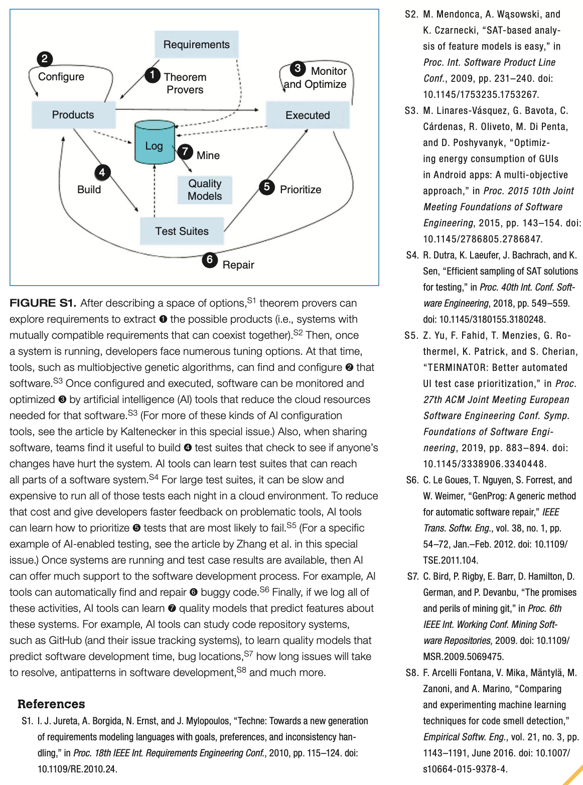

<a name=top>

&nbsp;<a href="https://tiny.cc/seng20">home</a> ::
<a href="https://github.com/txt/se20/blob/master/docs/syllabus.md#top">syllabus</a> ::
<a href="https://github.com/txt/se20/blob/master/docs/syllabus.md#timetable">timetable</a> ::
<a href="https://moodle-courses2021.wolfware.ncsu.edu/course/view.php?id=3873">moodle</a> ::
<a href="http://seng20.slack.com">chat</a>  ::
<a href="https://github.com/txt/se20/blob/master/LICENSE.md#top">&copy; 2020</a>  
 

# Project 1

## How to Pick  a Project

(Hint: do it now!)

Pick something:

- Cool: 
    - Cause you have to impress;
- Ambitious:
    -  Cause you are here to make mistakes
- Not too ambitious:
    - So you cannot make significant progress in 5 weeks;
- Not too small: 
    - So you can  impress people with the work;
- Small enough:
    - So you can finish;
- Where there is something already running:
    - So you get going fast;
- In a language that everyone in the team can handle:
    - So everyone can participate

If you want to be in the running for "best project" in task3, your system has to do something better then something else.

- Which means your code has to address some problem in some current system
- And do so in a manner that is quantifiable.
- For that kind of assessment, doing something AI related is useful (but don't feel oblidged to go there is you
  have other ideas).

 

## Deliverable check list

score each 0..4 (0=none, 2=ok, 4=Wow). Sum, divide by number of rows, multiple by 10.

Docs: what: point descriptions of each class/function (in isolation)
Docs: how: for common use cases X,Y,Z mini-tutorials showing worked examples on how to do X,Y,Z
Docs: why: docs tell a story, motivate the whole thing, deliver a punchline that makes you want to rush out and use the thing
Docs: 3 minute video, posted to YouTube. That convinces people why they want to work on your code.

